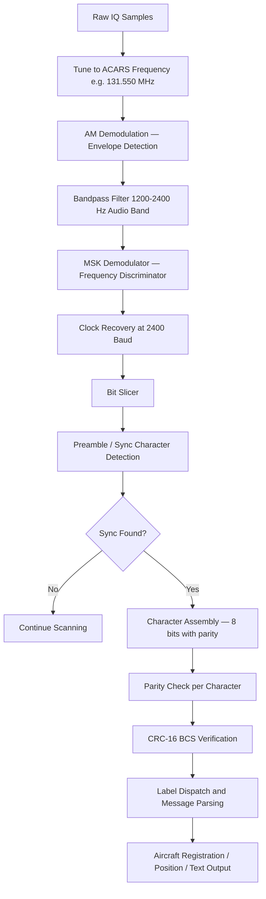

# Signal Specification: ACARS — Aircraft Communications Addressing and Reporting System

ACARS (Aircraft Communications Addressing and Reporting System) is a digital data link system for transmitting short messages between aircraft and ground stations via VHF radio. Originally developed by ARINC in 1978, ACARS carries operational messages including pre-departure clearances, OOOI events (Out of gate, Off ground, On ground, Into gate), weather reports, ATIS, position reports, and free-text messages. It remains one of the most widely deployed aviation data links.

---

## 1. Physical Layer Parameters

* **Primary Frequencies**:
  - **129.125 MHz** — Primary worldwide
  - **130.025 MHz** — Secondary / USA
  - **130.450 MHz** — USA / alternate
  - **131.125 MHz** — Additional
  - **131.550 MHz** — Primary European / global
  - **136.700 MHz** — Additional
  - **136.800 MHz** — Additional
  - **136.900 MHz** — Additional (HFDL-related)
* **Carrier Modulation**: Conventional AM (double-sideband, full carrier) — same as ATC voice.
* **Data Modulation**: Minimum Shift Keying (MSK) on the AM audio subcarrier at **2400 baud**.
* **Audio Subcarrier Frequencies**: 
  - MSK uses two tones: **1200 Hz** (mark/space depending on convention) and **2400 Hz**.
  - Mark = 2400 Hz, Space = 1200 Hz (CCITT convention).
* **Occupied Bandwidth**: ~6–8 kHz (AM envelope containing 2400 baud MSK).
* **PAPR**: Moderate. AM carrier with data bursts produces higher PAPR than constant-envelope schemes.
* **Channel Spacing**: 25 kHz (standard VHF aviation spacing).

---

## 2. Synchronization & Frame Geometry

### Packet Structure
ACARS messages follow the ARINC 618 standard:
```
| Preamble (16 bits) | Sync+ (2 chars) | SOH (1) | Mode (1) | Address (7) | TAK/NAK (1) | Label (2) |
| Block ID (1) | STX (1) | Message Text (variable, up to 220 chars) | ETX/ETB (1) | BCS (2) | DEL (1) | Suffix (1) |
```

### Field Details
* **Preamble**: Alternating `+` and `-` symbols (16 bit reversals at 2400 baud) for clock synchronization ≈ 6.67 ms.
* **Sync Characters**: Two sync characters (`*` and `*` or SYN+SYN = `0x2B 0x2A`) for character alignment.
* **SOH** (Start of Header): `0x01` — marks the start of the header block.
* **Mode Character**: Identifies the link type (e.g., `2` = ARINC 618 character mode).
* **Aircraft Address (Tail Number)**: 7-character aircraft registration (e.g., `.N12345`).
* **Label**: 2-character message type identifier:
  | Label | Meaning |
  |-------|---------|
  | `_d` | ACARS demand mode |
  | `H1` | HF Data Link report |
  | `SA` | Departure report (OOOI - Out) |
  | `RA` | Arrival report (OOOI - In) |
  | `Q0` | OOOI Off ground |
  | `QA` | OOOI On ground |
  | `.2` | Weather request |
  | `B6` | Free text (uplink) |

* **Message Text**: Variable length, up to **220 ASCII characters** (downlink) or **100 characters** (uplink). Uses 7-bit ASCII with odd parity (8th bit).
* **BCS**: Block Check Sequence — 16-bit CRC over the message block (CRC-16-CCITT).
* **DEL**: Deletion character `0x7F`.
* **Suffix**: End pad character.

### Timing
* **Preamble duration**: $\frac{16}{2400} \approx 6.67\ \text{ms}$
* **Minimum packet** (header only, no text): ~30 characters → $\frac{30 \times 8}{2400} = 100\ \text{ms}$
* **Maximum packet** (full 220-char message): ~250 characters → $\frac{250 \times 8}{2400} \approx 833\ \text{ms}$
* Typical burst duration: **50–200 ms** for most operational messages.

---

## 3. Demodulation & Decoding Pipeline



### 1. AM Demodulation
ACARS rides on a standard AM carrier. Extract the audio envelope:
$$a[n] = |s_{baseband}[n]| = \sqrt{I[n]^2 + Q[n]^2}$$

Alternatively, use a product detector (multiply by a local carrier replica and low-pass filter) for better SNR.

### 2. MSK Demodulation
The audio subcarrier uses MSK (Minimum Shift Keying) with tones at **1200 Hz** and **2400 Hz**. MSK is a continuous-phase FSK with modulation index $h = 0.5$:
$$f_{mark} = 2400\ \text{Hz}, \quad f_{space} = 1200\ \text{Hz}$$
$$\Delta f = f_{mark} - f_{space} = 1200\ \text{Hz} = \frac{R_b}{2} = \frac{2400}{2}$$

Apply a frequency discriminator or use a pair of correlators matched to the two tones:
$$\text{Bit} = \begin{cases} 1 & \text{if } E_{2400} > E_{1200} \\ 0 & \text{if } E_{1200} > E_{2400} \end{cases}$$

### 3. Clock Recovery
Synchronize to the 2400 baud symbol clock using zero-crossing detection or a PLL locked to the bit rate. The preamble's alternating pattern provides a clean training sequence.

### 4. Character Assembly
ACARS uses **8-bit characters** (7 data bits + 1 odd parity bit), transmitted **LSB first**. After assembling each character:
- Verify odd parity.
- Map to ASCII.

### 5. Frame Parsing
- Detect SOH (`0x01`) to identify the header start.
- Parse fixed-length header fields (Mode, Address, Label, Block ID).
- Extract variable-length message text between STX (`0x02`) and ETX (`0x03`) or ETB (`0x17`).
- Verify BCS (CRC-16-CCITT) over the block.

---

## 4. VDL Mode 2 (Next-Generation ACARS)

VDL Mode 2 is the successor to plain ACARS, operating on **136.725 MHz** and **136.975 MHz**:
* **Modulation**: D8PSK (Differential 8-Phase Shift Keying) at 10500 bps.
* **Protocol**: AVLC (Aviation VHF Link Control) — ISO 8208 / X.25 derived.
* **Bandwidth**: ~25 kHz.
* **Key Difference**: Much higher throughput and more structured protocol than legacy ACARS.
* **Decoder**: `dumpvdl2` is the primary open-source VDL2 decoder.

---

## 5. Companion Tools

| Tool | Description |
|------|-------------|
| **acarsdec** | Multi-channel ACARS decoder for RTL-SDR, Airspy, SDRplay |
| **dumpvdl2** | VDL Mode 2 decoder (next-gen ACARS) |
| **JAERO** | ACARS over satellite (Inmarsat C-band / L-band) decoder |
| **acarshub** | Docker-based ACARS aggregation and visualization |
| **Planeplotter** | Commercial ADS-B and ACARS display software |
| **libacars** | Library for decoding and formatting ACARS/ARINC messages |

---

## 6. Standards & References

* **ARINC 618**: Air/Ground Character-Oriented Protocol Specification (defines ACARS message format).
* **ARINC 620**: Data Link Ground System Standard and Interface Specification.
* **ICAO Annex 10, Vol III**: Aeronautical telecommunication — digital data link systems.
* **EUROCAE ED-100A / RTCA DO-281B**: Interoperability requirements for VDL Mode 2.
