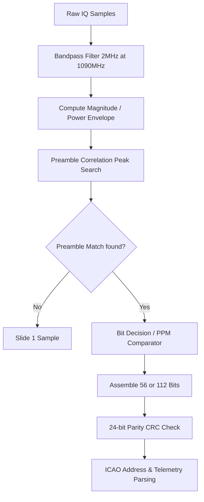

# Signal Specification: ADS-B Mode S (1090 MHz)

ADS-B (Automatic Dependent Surveillance-Broadcast) is an aviation surveillance technology in which an aircraft self-determines its position via satellite navigation and periodically broadcasts it, enabling it to be tracked. Mode S is the transponder standard used for these broadcasts.

---

## 1. Physical Layer Parameters

* **Frequency**: 1090 MHz (Aviation transponder downlink)
* **Modulation**: Pulse Position Modulation (PPM)
* **Bit Rate**: 1.0 Mbps (1 bit per microsecond)
* **Symbol Coding**: 
  - A '1' bit is encoded as a pulse in the first $0.5\ \mu\text{s}$ and quiet in the second $0.5\ \mu\text{s}$.
  - A '0' bit is encoded as quiet in the first $0.5\ \mu\text{s}$ and a pulse in the second $0.5\ \mu\text{s}$.
* **Occupied Bandwidth**: ~2.0 MHz to 2.5 MHz (determined by the $0.5\ \mu\text{s}$ rise/fall time transitions).
* **PAPR**: Medium-high (~3.0 dB to 6.0 dB during active pulse intervals, but measured high globally due to sparse bursts).

---

## 2. Synchronization & Frame Geometry

### Preamble structure
Each Mode S transmission starts with a unique **8.0 $\mu\text{s}$ synchronization preamble** containing four pulses of $0.5\ \mu\text{s}$ duration:
- **Pulse 1**: Start offset at **$0.0\ \mu\text{s}$**
- **Pulse 2**: Start offset at **$1.0\ \mu\text{s}$**
- **Pulse 3**: Start offset at **$3.5\ \mu\text{s}$**
- **Pulse 4**: Start offset at **$4.5\ \mu\text{s}$**

```
Time (µs):  0.0   1.0       3.5   4.5         8.0
Signal:    [###] [###]     [###] [###]       |-- Data start...
```

### Frame Lengths
Immediately following the 8.0 $\mu\text{s}$ preamble:
* **Short Frame (Mode A/C/S acquisition)**: 56 bits ($56\ \mu\text{s}$). Total transmission duration = **$64\ \mu\text{s}$**.
* **Long Frame (ADS-B Position/Velocity report)**: 112 bits ($112\ \mu\text{s}$). Total transmission duration = **$120\ \mu\text{s}$**.

---

## 3. Demodulation & Decoding Pipeline



### 1. Amplitude Extraction
ADS-B contains no phase-modulated data; the receiver only requires the magnitude (or power) envelope. Compute the magnitude of the complex samples:
$$m[n] = |s[n]| = \sqrt{I[n]^2 + Q[n]^2}$$

### 2. Preamble Matched Filter
Correlate the magnitude stream with the preamble reference template. For example, at a sample rate of **2.0 MSPS** (where each sample is $0.5\ \mu\text{s}$):
- Preamble template: `[1, 0, 1, 0, 0, 0, 0, 1, 0, 1, 0, 0, 0, 0, 0, 0]`
- Locate correlation peaks that stand out significantly above the background noise floor.

### 3. PPM Bit Decision
For each bit interval starting at index $S_{start}$ (which is 16 samples after the preamble peak at 2.0 MSPS):
- Sample $A$ (first $0.5\ \mu\text{s}$): $m[S_{start}]$
- Sample $B$ (second $0.5\ \mu\text{s}$): $m[S_{start} + 1]$
- **Decision Rule**:
  - If $A > B \implies \mathbf{1}$
  - If $A < B \implies \mathbf{0}$
- Advance $S_{start}$ by 2 samples ($1.0\ \mu\text{s}$) and repeat for all 56 or 112 bits.
