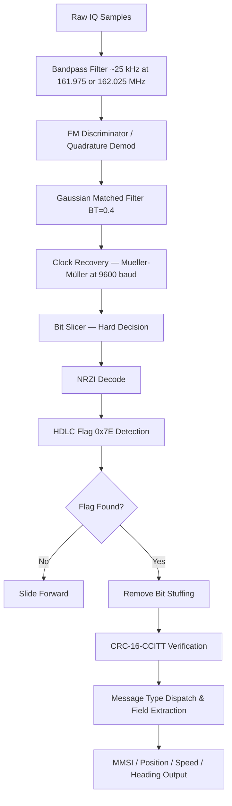

# Signal Specification: AIS — Automatic Identification System (VHF Maritime)

AIS (Automatic Identification System) is a maritime vessel tracking system that broadcasts ship identity, position, speed, course, and navigational status. All vessels above 300 gross tonnage on international voyages (and many smaller craft) are required to carry AIS transponders under IMO SOLAS V/19. AIS uses Self-Organizing Time Division Multiple Access (SOTDMA) on two dedicated VHF channels.

---

## 1. Physical Layer Parameters

* **Frequencies**:
  - **Channel 87B (AIS 1)**: 161.975 MHz
  - **Channel 88B (AIS 2)**: 162.025 MHz
* **Channel Spacing**: 25 kHz
* **Modulation**: Gaussian Minimum Shift Keying (GMSK) with BT = 0.4
* **Bit Rate**: 9600 bps
* **Occupied Bandwidth**: ~16 kHz (99% OBW)
* **PAPR**: Very low (~0 dB), constant-envelope modulation.
* **Encoding**: NRZI (Non-Return-to-Zero Inverted) — a logical '0' causes a transition, a logical '1' causes no transition.
* **Data Link Layer**: HDLC framing (ITU-R M.1371 / IEC 62320-1)

---

## 2. Synchronization & Frame Geometry

### TDMA Slot Structure
AIS uses a one-minute frame divided into **2250 slots per channel**. Each slot is exactly:
$$T_{slot} = \frac{60\ \text{s}}{2250} \approx 26.667\ \text{ms}$$

Each slot carries one transmission opportunity. Vessels self-organize slot reservations using SOTDMA, ITDMA (Incremental TDMA), or RATDMA (Random Access TDMA).

### Packet Format
Each AIS transmission uses HDLC framing:
```
| Training (24 bits) | Start Flag 0x7E (8 bits) | Data (168 bits*) | FCS/CRC (16 bits) | End Flag 0x7E (8 bits) | Buffer (24 bits) |
```
- **Training Sequence**: 24 alternating bits (`010101...`) for clock recovery.
- **Start Flag**: `0x7E` (01111110) — HDLC opening flag.
- **Data Payload**: 168 bits for standard position reports (Message Types 1, 2, 3). Up to **1192 bits** for multi-slot messages (Message Type 5: Static and Voyage Related Data uses 2 slots = 424 data bits).
- **FCS**: 16-bit Frame Check Sequence (CRC-16-CCITT, polynomial $x^{16} + x^{12} + x^{5} + 1$).
- **End Flag**: `0x7E` (01111110).
- **Bit Stuffing**: After every five consecutive '1' bits, a '0' is inserted (standard HDLC).

### Key Message Types
| Type | Name | Bits | Slots |
|------|------|------|-------|
| 1, 2, 3 | Position Report | 168 | 1 |
| 5 | Static & Voyage Data | 424 | 2 |
| 18 | Standard Class B Position | 168 | 1 |
| 21 | Aid-to-Navigation Report | 360 | 1-2 |
| 24 | Class B Static Data | 168 | 1 |

### Data Fields (Message Types 1/2/3)
```
| Msg Type (6) | Repeat (2) | MMSI (30) | Nav Status (4) | ROT (8) | SOG (10) | Pos Accuracy (1) |
| Longitude (28) | Latitude (27) | COG (12) | Heading (9) | Timestamp (6) | Maneuver (2) |
| Spare (3) | RAIM (1) | Radio Status (19) | = 168 bits total |
```

---

## 3. Demodulation & Decoding Pipeline



### 1. FM Demodulation
GMSK is a constant-envelope modulation. The information is encoded in the instantaneous frequency deviation. Apply a quadrature (FM) discriminator:
$$f_{inst}[n] = \frac{1}{2\pi} \cdot \text{arg}\left(s[n] \cdot s^*[n-1]\right)$$

The output is a bipolar baseband signal where positive/negative frequency deviations represent binary symbols.

### 2. Gaussian Matched Filter
Apply a Gaussian filter matched to BT = 0.4 to maximize eye opening and minimize ISI. The Gaussian impulse response is:
$$h(t) = \frac{1}{\sqrt{2\pi}\sigma T_b} \exp\left(-\frac{t^2}{2(\sigma T_b)^2}\right), \quad \sigma = \frac{\sqrt{\ln 2}}{2\pi B T_b}$$

### 3. Clock Recovery
Use Mueller-Müller or Gardner timing error detector at the symbol rate of **9600 baud**. At a sample rate of 48 kHz, this is 5 samples per symbol.

### 4. NRZI Decoding
After slicing symbols to binary:
- If the current bit equals the previous bit → output `1`
- If the current bit differs from the previous bit → output `0`

### 5. HDLC Deframing
- Scan for `0x7E` flag patterns (`01111110`).
- Remove inserted '0' bits after sequences of five consecutive '1' bits (bit-destuffing).
- Extract the data payload between start and end flags.

### 6. CRC Validation
Compute CRC-16-CCITT over the data payload (excluding flags). If the remainder equals the received FCS, the frame is valid.

---

## 4. Companion Tools

| Tool | Description |
|------|-------------|
| **rtl_ais** | Lightweight RTL-SDR AIS decoder, dual-channel capable |
| **AISdeco2** | AIS decoder with web interface and NMEA output |
| **gnuais** | GNU AIS decoder, outputs NMEA sentences |
| **gr-ais** | GNU Radio AIS receiver blocks |
| **OpenCPN** | Chart plotter that displays AIS targets on nautical charts |
| **aisdecoder** | Decodes AIS NMEA sentences to human-readable fields |

---

## 5. Standards & References

* **ITU-R M.1371-5**: Technical characteristics for an automatic identification system using time division multiple access in the VHF maritime mobile band.
* **IEC 62320-1**: Maritime navigation — AIS — Part 1: Minimum operational and performance requirements.
* **ITU-R M.1084**: Interim solutions for improved efficiency in the use of the band 156–174 MHz by stations in the maritime mobile service.
