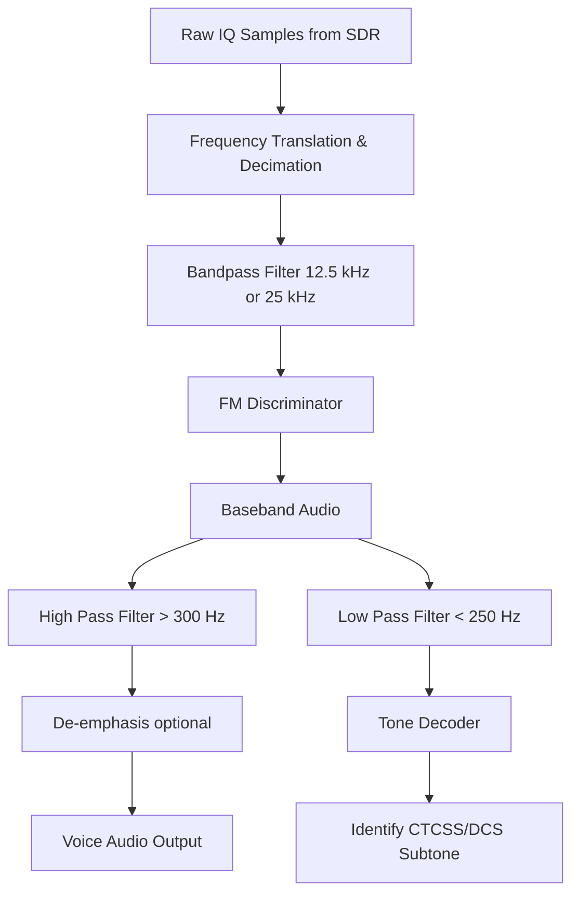

# Signal Specification: Amateur Radio FM Repeaters

Amateur (Ham) radio operators use frequency-modulated (FM) voice repeaters to extend the range of their handheld and mobile radios. A repeater is a high-power radio system located on a high elevation (like a mountain or tall building) that listens on one frequency and simultaneously retransmits the audio on another. These are some of the most common and easiest signals to intercept with an SDR.

---

## 1. Physical Layer Parameters

* **Frequency Bands**:
  * **2-meter band**: 144–148 MHz (VHF)
  * **70-centimeter band**: 420–450 MHz (UHF)
  * **1.25-meter band**: 222–225 MHz (VHF - primarily Americas)
* **Channel Spacing**: Typically 15 kHz, 20 kHz, or 25 kHz.
* **Modulation**: Narrowband Frequency Modulation (NBFM)
  * **Standard Deviation**: ±5 kHz
  * **Narrowband Deviation**: ±2.5 kHz (becoming more common)
* **Repeater Offset**: The difference between the input (listen) and output (transmit) frequencies.
  * 2-meter: ±600 kHz
  * 70-centimeter: ±5 MHz
* **Audio Bandwidth**: ~300 Hz to 3000 Hz.

---

## 2. Access and Control Signaling

Because repeaters are open to the public but subject to interference, they use subaudible signaling to prevent noise or distant stations from opening the repeater.

* **CTCSS (Continuous Tone-Coded Squelch System)**: Also known as "PL Tones." A continuous, subaudible sine wave (between 67.0 Hz and 254.1 Hz) transmitted simultaneously with the voice audio. The repeater only activates if the correct tone is present.
* **DCS (Digital-Coded Squelch)**: A continuous stream of subaudible digital FSK data (at 134 bps) representing a 3-digit octal code.
* **Repeater ID**: FCC/ITU regulations require repeaters to identify themselves periodically (usually every 10 minutes). This is done via a synthesized voice or, very commonly, a 1000 Hz CW (Morse Code) audio tone mixed with the carrier.
* **Courtesy Tone**: A short "beep" transmitted by the repeater after a user unkeys their radio. It serves to let the next person know the repeater is ready and allows time for emergency traffic to break in.

### Digital Voice on FM Repeaters
Many modern repeaters carry digital voice instead of analog FM. These sound like harsh static to an analog receiver.
* **DMR**: 4FSK modulation, TDMA (2 slots).
* **System Fusion (C4FM)**: C4FM modulation, continuous data.
* **D-STAR**: GMSK modulation at 4800 baud.

---

## 3. Demodulation Pipeline

---

## 4. Companion Tools

| Tool | Platform | Description |
|---|---|---|
| **rtl_fm** | CLI | `rtl_fm -f 146.52M -M fm -s 22000 -r 48000 - | play -t raw -r 48000 -e s -b 16 -c 1 -V1 -` |
| **GQRX** | GUI | Standard SDR visualizer, excellent for scanning amateur bands. Includes a squelch slider. |
| **SDR# (SDRSharp)** | GUI | Windows standard. Has built-in CTCSS/DCS decoding plugins. |
| **SDRTrunk** | GUI/CLI | Can monitor multiple repeater channels simultaneously and decode digital modes (DMR, P25). |
| **multimon-ng** | CLI | Useful for decoding the CW (Morse Code) repeater IDs. |

---

## 5. Standards & References
* **ARRL Repeater Directory**: Lists frequencies and access tones for North American repeaters.
* **ITU Radio Regulations**: Defines the amateur service allocations globally.
