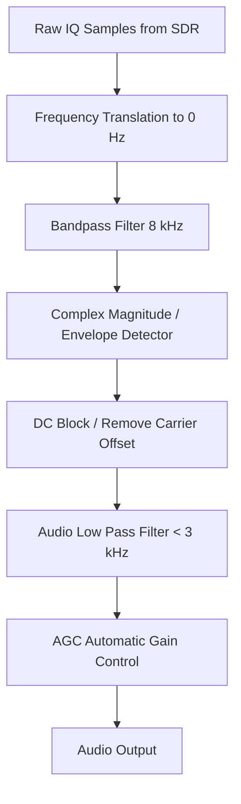

# Signal Specification: Citizens Band (CB) Radio

Citizens Band (CB) radio is a land mobile radio system allowing short-distance person-to-person bidirectional voice communication. It operates in the 27 MHz High Frequency (HF) band. Because it is HF, it relies on ground-wave propagation for local comms (5–15 miles), but during peaks in the 11-year solar cycle, ionospheric "skip" can cause CB signals to travel hundreds or thousands of miles. 

---

## 1. Physical Layer Parameters

* **Frequency Band**: 26.965 MHz to 27.405 MHz (11-meter band)
* **Channelization**: 40 discrete channels
  * Channel spacing is 10 kHz, but the channels are not perfectly contiguous (there are gaps, e.g., for RC toys at 27.145 MHz).
  * **Channel 9** (27.065 MHz): Emergency channel.
  * **Channel 19** (27.185 MHz): Highway / Trucker channel.
* **Modulation Options**:
  1. **AM (Amplitude Modulation)**: The traditional and most common mode.
  2. **SSB (Single Sideband)**: Usually LSB (Lower Sideband) on channels 36-40. Provides greater range by concentrating all power into one sideband and suppressing the carrier.
  3. **FM (Frequency Modulation)**: Recently legalized in the US (2021) and standard in parts of Europe.
* **Occupied Bandwidth**:
  * AM/FM: ~8 kHz
  * SSB: ~3 kHz
* **Maximum Transmit Power (US)**:
  * 4 Watts (AM/FM carrier)
  * 12 Watts PEP (SSB)

---

## 2. SDR Hardware Considerations

> **⚠️ Hardware Warning**: 27 MHz is at the extreme low end of the VHF spectrum, crossing into HF. 
> * **RTL-SDR (v3/v4)**: Can receive CB radio, but you *must* enable Direct Sampling mode (Q-branch) in your SDR software, as the standard R820T2 tuner chips bottom out around 24 MHz.
> * **HackRF / SDRplay**: Can tune to 27 MHz natively without workarounds.
> * **Antenna**: A standard tiny VHF/UHF whip antenna is horribly inefficient at 27 MHz (wavelength is 11 meters). You need a long wire or a dedicated CB antenna to hear anything but the closest trucks.

---

## 3. Demodulation Pipeline (AM Mode)

---

## 4. Companion Tools

| Tool | Platform | Description |
|---|---|---|
| **rtl_fm** | CLI | To use direct sampling on RTL-SDR v3/v4: `rtl_fm -E direct -f 27.185M -M am -s 12k - | play -t raw -r 12k -e s -b 16 -c 1 -V1 -` |
| **GQRX** | GUI | Standard SDR visualizer. Remember to set the hardware string to `rtl=0,direct_samp=2` if using an RTL-SDR. |
| **SDR# (SDRSharp)** | GUI | Easy drop-down to switch between AM, LSB, USB, and FM. |

---

## 5. Standards & References
* **FCC Part 95 Subpart D**: Citizens Band (CB) Radio Service.
