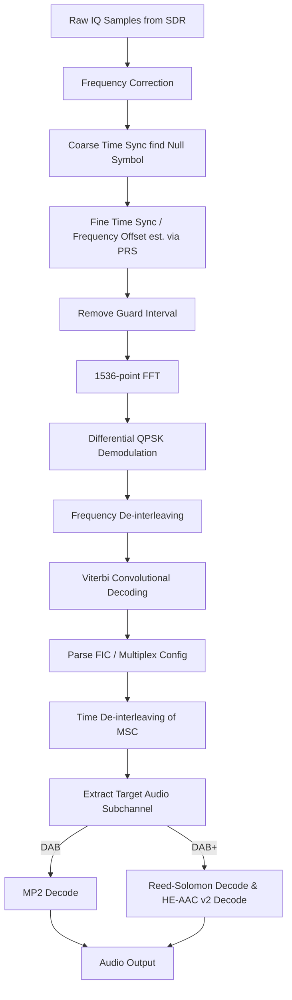

# Signal Specification: Digital Audio Broadcasting (DAB/DAB+)

Digital Audio Broadcasting (DAB and its successor DAB+) is the digital radio standard used extensively throughout Europe, Australia, and parts of Asia and Africa. It provides high-quality digital audio multiplexed with metadata, text, and sometimes images. Unlike traditional FM where each station has its own frequency, DAB groups multiple stations into a single wideband "ensemble" or "multiplex."

---

## 1. Physical Layer Parameters

* **Frequency Band**: VHF Band III (174–240 MHz)
  * Formerly used L-Band (1452–1492 MHz), but this is mostly deprecated for DAB.
* **Channel Structure**: The band is divided into channels/blocks (e.g., 5A, 11C, 12B).
* **Center Frequencies**:
  * Block 11A = 216.928 MHz
  * Block 11B = 218.640 MHz
  * Block 11C = 220.352 MHz
  * Block 11D = 222.064 MHz
* **Modulation**: Coded Orthogonal Frequency Division Multiplexing (COFDM)
  * **Subcarrier Modulation**: Differential QPSK (DQPSK)
* **Bandwidth**: 1.536 MHz per ensemble.
* **Subcarriers (Mode I)**: 1536 active subcarriers with 1 kHz spacing.
* **Frame Duration (Mode I)**: 96 ms, consisting of 76 OFDM symbols.
* **Guard Interval (Mode I)**: 246 µs (allows for Single Frequency Networks (SFN)).

---

## 2. Synchronization & Frame Geometry

DAB uses a highly structured framing system.

* **Null Symbol**: Each 96 ms transmission frame begins with a Null Symbol (a period of no RF energy for ~1.29 ms). This provides an easy way for receivers to achieve coarse time synchronization.
* **Phase Reference Symbol (PRS)**: The second symbol is a known reference sequence used for fine synchronization and to provide the phase reference for the differential QPSK demodulation of subsequent symbols.
* **Fast Information Channel (FIC)**: Carries the Multiplex Configuration Information (MCI). Non-time-interleaved, highly protected, allowing the receiver to instantly know what audio services are available in the ensemble and where they are located.
* **Main Service Channel (MSC)**: Contains the actual audio streams and data services, heavily time-interleaved (over ~384 ms) to resist fading.

### DAB vs DAB+
At the physical (RF) layer, DAB and DAB+ are identical. The difference is in the audio payload encoding within the MSC:
* **DAB**: Uses MPEG-1 Audio Layer II (MP2).
* **DAB+**: Uses HE-AAC v2 audio coding and adds Reed-Solomon error correction to the audio frames, allowing for better audio quality at much lower bitrates, thereby fitting more stations into a single ensemble.

---

## 3. Demodulation Pipeline

---

## 4. Companion Tools

| Tool | Platform | Description |
|---|---|---|
| **welle.io** | GUI (Cross-platform) | Excellent open-source DAB/DAB+ software-defined radio. User-friendly with full MOT (Multimedia Object Transfer) slide support. |
| **qt-dab** | GUI (Linux/Windows) | Comprehensive DAB/DAB+ receiver software for SDRs. |
| **dablin** | CLI (Linux) | A DAB/DAB+ player for Linux. Takes ETI (Ensemble Transport Interface) streams from tools like `eti-cmdline` or `dab2eti`. |
| **SDRangel** | GUI | Includes a DAB demodulator plugin. |

---

## 5. Standards & References
* **ETSI EN 300 401**: Radio Broadcasting Systems; Digital Audio Broadcasting (DAB) to mobile, portable and fixed receivers.
* **ETSI TS 102 563**: Transport of Advanced Audio Coding (AAC) audio (DAB+ specification).
