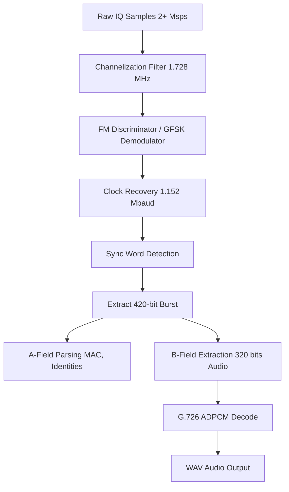

# Signal Specification: DECT Cordless Telephone

Digital Enhanced Cordless Telecommunications (DECT) is the global standard for cordless telephones, baby monitors, and some wireless headsets (like high-end enterprise headsets). It is extremely common in residential and commercial buildings. DECT operates in a dedicated frequency band, ensuring interference-free audio compared to Wi-Fi/Bluetooth.

---

## 1. Physical Layer Parameters

* **Frequency Band**:
  * **Europe/Global**: 1880–1900 MHz
  * **US (DECT 6.0 / UPCS)**: 1920–1930 MHz
  * **Latin America / Asia**: 1910–1930 MHz (varies)
* **Channel Spacing**: 1.728 MHz
* **Number of Channels**: 10 (EU), 5 (US)
* **Modulation**: GFSK (Gaussian Frequency Shift Keying)
  * BT = 0.5 (Gaussian filter bandwidth-time product)
  * Nominal deviation: ±288 kHz
* **Data Rate**: 1.152 Mbps
* **Symbol Rate**: 1.152 Mbaud

---

## 2. Synchronization & Frame Geometry

DECT uses a combination of FDMA (Frequency Division), TDMA (Time Division), and TDD (Time Division Duplexing) to allow multiple handsets to share the base station without colliding.

* **Frame Duration**: 10 ms
* **Time Slots**: 24 time slots per frame
  * Slots 0-11: Downlink (Base station to handset)
  * Slots 12-23: Uplink (Handset to base station)
* **Slot Duration**: 416.7 µs (approx 480 bits)
* **Payload per Slot**: 320 data bits (the B-field), which translates exactly to 32 kbps of audio data (320 bits / 10 ms = 32,000 bps).

### The "Beacon" (Dummy Bearer)
Even when no call is active, a DECT base station continuously transmits a "dummy bearer" on at least one channel and time slot. This beacon allows idle handsets to lock onto the base station's timing, frequency, and identity. 

* **Audio Codec**: Typically G.726 ADPCM at 32 kbps (standard voice). DECT can also negotiate wideband audio (G.722 at 64 kbps), which consumes two time slots.

---

## 3. Demodulation Pipeline

---

## 4. Companion Tools

| Tool | Platform | Description |
|---|---|---|
| **gr-dect2** | Linux | Standard GNU Radio implementation for DECT decoding. Can parse A-fields and dump raw audio. |
| **dedected** | Linux | (Historical) A project by Domonkos Tomcsányi to analyze DECT security and decode audio using specific PCMCIA DECT cards or SDR. |
| **osmo-dect-sniff** | Linux | Command-line tool from Osmocom for DECT packet analysis. |

> **⚠️ Legal Warning**: Intercepting and decoding the B-field (voice payload) of DECT phone calls without the consent of the parties involved is a severe wiretapping violation in almost all jurisdictions. DECT research should be confined to your own equipment or analyzing A-field metadata (base station IDs) only. Modern DECT systems also support encryption (Standard Authentication Algorithm / DSC), which makes passive audio interception impossible.

---

## 5. Standards & References
* **ETSI EN 300 175-2**: DECT Common Interface (CI); Part 2: Physical Layer (PHL).
* **ETSI EN 300 175-3**: DECT Common Interface (CI); Part 3: Medium Access Control (MAC) layer.
