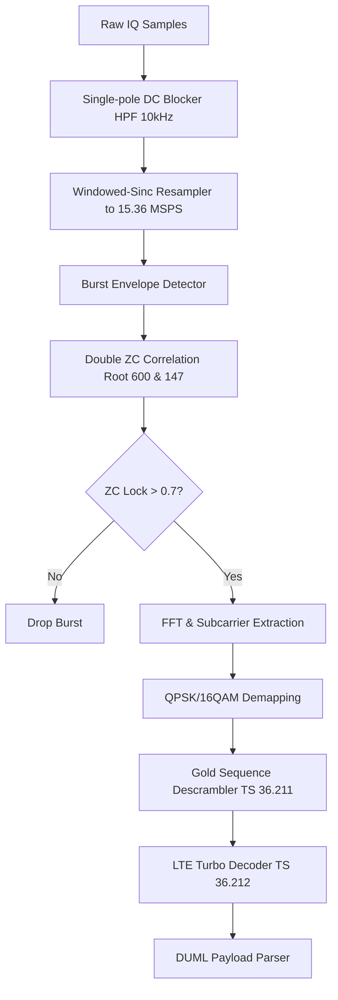

# Signal Specification: DJI OcuSync (O1–O4)

DJI OcuSync is a proprietary wireless transmission technology developed by DJI for video transmission and remote control telemetry. It is built on top of LTE-like Orthogonal Frequency Division Multiplexing (OFDM) and operates primarily in the 2.4 GHz and 5.8 GHz ISM bands.

---

## 1. Physical Layer Parameters

* **Frequency Bands**: 
  - 2.4 GHz ISM (2400.0 - 2483.5 MHz)
  - 5.8 GHz ISM (5725.0 - 5850.0 MHz)
* **Channel Bandwidths**: 
  - 10 MHz (Internal default detector mode geometry)
  - 1.4 MHz, 3.0 MHz, 20.0 MHz, 40.0 MHz, 60.0 MHz (Dynamic mode switching based on link quality)
* **Multiplexing**: OFDM (Orthogonal Frequency Division Multiplexing)
* **Subcarrier Spacing**: 15 kHz (identical to 3GPP LTE)
* **FFT Size (10 MHz mode)**: 1024 points
* **Active Subcarriers (10 MHz mode)**: 601 subcarriers
* **Sample Rates**: 
  - 15.36 MSPS (for 10 MHz mode)
  - 30.72 MSPS (for 20 MHz mode)
  - 61.44 MSPS (for 40 MHz mode)
  - 92.16 MSPS (for 60 MHz mode)

---

## 2. Synchronization & Frame Geometry

### Primary Sync Signal (PSS) & Pilots
OcuSync utilizes Zadoff-Chu (ZC) sequences for burst synchronization and frame detection. A burst is classified as DJI only when a **"Double ZC Lock"** is established:
1. **Primary Hardware Pilot**: ZC Sequence with **Root 600**, length $N_{ZC} = 601$ (or 63 mapped to subcarriers).
2. **Universal Pilot**: ZC Sequence with **Root 147**, length $N_{ZC} = 601$.

The normalized correlation score against both sequences must exceed **0.7** to confirm detection.

### Symbol Duration
- **Useful Symbol Duration ($T_u$)**: $1 / 15\ \text{kHz} \approx 66.67\ \mu\text{s}$ (1024 samples at 15.36 MSPS)
- **Cyclic Prefix ($T_{cp}$)**: Normal LTE CP is $4.69\ \mu\text{s}$ (72 samples at 15.36 MSPS). 
- **Total Symbol Duration**: $T_s \approx 71.35\ \mu\text{s}$ (1096 or 1100 samples at 15.36 MSPS).

---

## 3. Demodulation & Decoding Pipeline

### 1. DC Leakage Suppression
Apply a single-pole high-pass filter (HPF) with a cutoff frequency around $\approx 10\ \text{kHz}$ to eliminate local oscillator leakage spurs without corrupting the active subcarriers:
$$y[n] = x[n] - x[n-1] + \alpha \cdot y[n-1]$$
where $\alpha \approx 0.996$ at 15.36 MSPS.

### 2. LTE Turbo Decoder (3GPP TS 36.212)
- **Channel Coding**: Rate 1/3 turbo encoder with trellis termination.
- **Rate Dematcher**: Circular buffer rate dematching with soft combining of repeat bits for SNR gain.
- **De-scrambling**: Scrambled using a Gold sequence initialized according to 3GPP TS 36.211 §7.2.

---

## 4. Telemetry Parsing (Plaintext DJI DroneID)
Plaintext DroneID broadcasts (O1–O3 in 10 MHz mode) contain structured packets with:
- **DUML Headers**: Magic byte `0x55`, length, source, target, packet sequence number.
- **Telemetry Payload**: Coordinates (Latitude, Longitude), Altitude, Velocity, Heading, Pilot Position, Serial Number (visible in plaintext format), and Product Type.
- **Encryption**: O4 uses an encrypted payload and wider modes (20/40/60 MHz) are opaque (outputting `is_cipher: true`).
