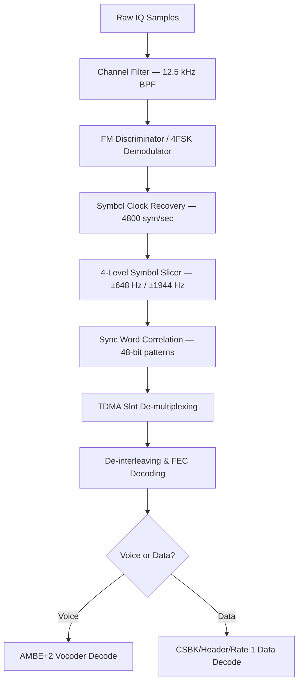

# Signal Specification: Digital Mobile Radio (DMR, P25, TETRA, NXDN, D-STAR)

Digital Mobile Radio encompasses a family of digital land mobile radio (LMR) standards designed for professional and public safety communications. DMR (ETSI TS 102 361) is the most widely deployed commercial standard. P25 (TIA-102) dominates US public safety. TETRA (ETSI EN 300 392) is the European public safety standard. D-STAR and NXDN serve amateur and commercial niches respectively.

---

## 1. Physical Layer Parameters

### DMR (ETSI TS 102 361)

* **Frequency Bands**:
  - VHF: 136–174 MHz
  - UHF: 400–527 MHz
  - 800/900 MHz (some deployments)
* **Modulation**: 4FSK (4-level Frequency Shift Keying)
  - Symbol-to-deviation mapping:
    | Symbol | Bit Pair | Deviation |
    |---|---|---|
    | +3 | 01 | +1944 Hz |
    | +1 | 00 | +648 Hz |
    | −1 | 10 | −648 Hz |
    | −3 | 11 | −1944 Hz |
* **Symbol Rate**: 4800 symbols/sec
* **Bit Rate**: 9600 bps (2 bits per symbol)
* **Channel Bandwidth**: 12.5 kHz (FDMA channel spacing)
* **Access Method**: 2-slot TDMA (Time Division Multiple Access)
  - Each 12.5 kHz channel carries 2 independent voice/data time slots
  - Slot duration: 30 ms (each), total frame: 60 ms
* **Voice Codec**: AMBE+2™ (Advanced Multi-Band Excitation), 3600 bps

### P25 Phase 1 (TIA-102.BAAA)

* **Frequency Bands**: VHF (136–174 MHz), UHF (380–512 MHz), 700/800 MHz
* **Modulation**: C4FM (Continuous 4-level FM) or CQPSK (Compatible Quadrature PSK for simulcast)
  - C4FM deviation: ±1800 Hz (±600 Hz inner levels)
* **Symbol Rate**: 4800 symbols/sec
* **Bit Rate**: 9600 bps
* **Channel Bandwidth**: 12.5 kHz (FDMA)
* **Access Method**: FDMA only (no TDMA)
* **Voice Codec**: IMBE (Improved Multi-Band Excitation), 4400 bps

### P25 Phase 2 (TIA-102.BBAC)

* **Frequency Bands**: Same as Phase 1
* **Modulation**: H-DQPSK (Harmonized Differential Quadrature Phase Shift Keying)
* **Symbol Rate**: 6000 symbols/sec
* **Bit Rate**: 12000 bps
* **Channel Bandwidth**: 12.5 kHz
* **Access Method**: 2-slot TDMA (like DMR)
* **Voice Codec**: AMBE+2™, 3600 bps

### TETRA (ETSI EN 300 392)

* **Frequency Bands**: 380–400 MHz (public safety), 410–430 MHz, 450–470 MHz, 870–876/915–921 MHz
* **Modulation**: π/4 DQPSK (Differential Quadrature Phase Shift Keying)
* **Symbol Rate**: 18000 symbols/sec (18 kBaud)
* **Bit Rate**: 36000 bps gross
* **Channel Bandwidth**: 25 kHz
* **Access Method**: 4-slot TDMA
  - Frame duration: 56.67 ms
  - Multiframe: 18 frames = 1.02 s
* **Voice Codec**: ACELP (Algebraic Code Excited Linear Prediction), 4800 bps net

### D-STAR (JARL)

* **Frequency Bands**: 144 MHz (VHF), 430 MHz (UHF), 1.2 GHz
* **Modulation**: GMSK (Gaussian Minimum Shift Keying), BT = 0.5
* **Bit Rate**:
  - DV (Digital Voice) mode: 4800 bps total (2400 bps AMBE voice + 1200 bps FEC + 1200 bps data)
  - DD (Digital Data) mode: 128 kbps (1.2 GHz only)
* **Channel Bandwidth**: 6.25 kHz (DV), 150 kHz (DD)
* **Access Method**: FDMA

### NXDN (Kenwood/Icom)

* **Frequency Bands**: VHF (136–174 MHz), UHF (400–520 MHz)
* **Modulation**: 4FSK, ±1050 Hz / ±350 Hz deviation
* **Symbol Rate**: 2400 symbols/sec
* **Bit Rate**: 4800 bps
* **Channel Bandwidth**: 6.25 kHz (NXDN48) or 12.5 kHz (NXDN96)
* **Access Method**: FDMA

---

## 2. Synchronization & Frame Geometry

### DMR Frame Structure

```
| CACH (24 bits) | Payload Slot 1 (108 bits) | SYNC (48 bits) | Payload Slot 1 (108 bits) | CACH | Payload Slot 2 (108 bits) | SYNC (48 bits) | Payload Slot 2 (108 bits) |
```

#### DMR Burst Format (per time slot)
```
| Payload Part 1 (108 bits) | SYNC/EMB (48 bits) | Payload Part 2 (108 bits) |
```
- Total burst: **264 bits** at 4800 symbols/sec = **27.5 ms** active + **2.5 ms** guard time = **30 ms** slot.
- Full TDMA frame = 2 slots = **60 ms**.

#### DMR Sync Patterns (48 bits)
| Sync Type | Hex Pattern |
|---|---|
| BS Voice | `0x755FD7DF75F7` |
| BS Data | `0xDFF57D75DF5D` |
| MS Voice | `0x7F7D5DD57DFD` |
| MS Data | `0xD5D7F77FD757` |

### P25 Phase 1 Frame Structure

```
| Frame Sync (48 bits) | NID (64 bits) | Voice/Data Units | LDU (Logical Data Unit) |
```

#### P25 Frame Sync
- 48-bit pattern: `0x5575F5FF77FF`
- Network ID (NID): 64 bits containing NAC (Network Access Code) and DUID (Data Unit ID).

### TETRA Frame Structure

```
| Normal Burst: Training Seq (22 sym) | Coded Data (216 sym) | Training Seq (22 sym) | Tail (2 sym) |
```
- **Normal burst**: 255 symbols = 14.167 ms
- 4 bursts per TDMA frame = 56.67 ms
- 18 frames per multiframe = 1.02 s

---

## 3. Demodulation & Decoding Pipeline

### DMR Demodulation



### 4FSK Demodulation Detail

1. **FM Discriminator Output**: Apply the instantaneous frequency estimator:
   $$f_{inst}[n] = \frac{f_s}{2\pi} \cdot \angle \left( r[n] \cdot r^*[n-1] \right)$$

2. **4-Level Symbol Slicing**: Map the discriminator output to one of four symbol levels using decision thresholds:
   - $f > +1296$ Hz → Symbol +3 (bits `01`)
   - $+1296 > f > 0$ Hz → Symbol +1 (bits `00`)
   - $0 > f > -1296$ Hz → Symbol −1 (bits `10`)
   - $f < -1296$ Hz → Symbol −3 (bits `11`)

3. **Clock Recovery**: Use a Gardner timing error detector tuned to the 4800 symbol/sec rate. The preamble and sync patterns provide initial timing lock.

---

## 4. Companion Tools

| Tool | Platform | Protocols Supported |
|---|---|---|
| **DSD (Digital Speech Decoder)** | Linux/macOS | DMR, P25, NXDN, D-STAR, ProVoice |
| **DSD+** | Windows | DMR, P25 Phase 1/2, NXDN, D-STAR, TETRA |
| **SDRTrunk** | Java/Cross-platform | DMR, P25, trunking control channels |
| **OP25** | Linux (GNU Radio) | P25 Phase 1/2 with full trunking |
| **tetra-kit** | Linux | TETRA demodulation and decoding |
| **dsd-fme** | Linux | Fork of DSD with enhanced DMR/NXDN support |
| **GNU Radio gr-op25** | Linux | P25 GNU Radio out-of-tree module |
