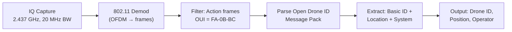
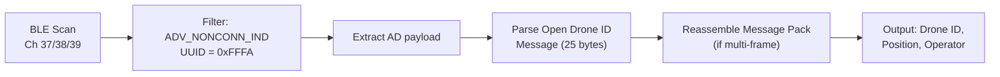

# Signal Specification: Drone Remote ID (Wi-Fi & Bluetooth) 🛩️📡

Drone Remote ID — mandatory identification broadcast for UAS (Unmanned Aircraft Systems). Required by FAA (14 CFR Part 89, effective March 2024) and EU (EU 2019/945, effective January 2024). Based on the ASTM F3411-22a "Open Drone ID" standard.

**Think of it as ADS-B for drones** — every drone broadcasts its identity, position, and operator location.

---

## 1. Overview

| Parameter | Detail |
|---|---|
| **Standard** | ASTM F3411-22a (Open Drone ID), ASD-STAN prEN 4709-002 (EU) |
| **Regulation** | FAA 14 CFR Part 89 (US), EU 2019/945 + 2020/1058 (EU) |
| **Broadcast Methods** | Wi-Fi NAN / Wi-Fi Beacon **AND/OR** Bluetooth 4.x/5.x Advertising |
| **Broadcast Rate** | ≥ 1 Hz (at least once per second) |
| **Range** | 100–500 m (BLE), up to 1 km (Wi-Fi) |
| **Mandatory Since** | March 16, 2024 (US FAA), January 1, 2024 (EU) |

---

## 2. Broadcast Method 1: Wi-Fi (802.11)

### Wi-Fi NAN (Neighbor Awareness Networking)
* **Frequency**: 2.437 GHz (Channel 6) — **fixed channel**
* **Frame Type**: 802.11 Action frame, Category = Public, Action = Vendor Specific
* **Discovery Window**: 16 ms NAN Discovery Window, 512 ms interval
* **OUI**: FA-0B-BC (Wi-Fi Alliance OUI for Remote ID)
* **Channel Width**: 20 MHz standard Wi-Fi
* **Modulation**: OFDM (standard 802.11g/n)
* **No association required** — broadcast in clear, no Wi-Fi network join needed

### Wi-Fi Beacon
* **Frequency**: 2.4 GHz band (channel chosen by drone)
* **Frame Type**: 802.11 Beacon frame with Vendor Specific IE
* **OUI**: FA-0B-BC
* **SSID**: Typically hidden or set to drone manufacturer name
* **Advantage**: Doesn't require NAN support (wider hardware compatibility)

### Wi-Fi Frame Structure
```
| 802.11 MAC Header | Category: Public (0x04) | Action: Vendor Specific (0x09) |
| OUI: FA-0B-BC | OUI Type: 0x0D | Open Drone ID Message Pack |
```

---

## 3. Broadcast Method 2: Bluetooth (BLE)

### Bluetooth 4.x Legacy Advertising
* **Frequency**: BLE advertising channels 37/38/39 (2402, 2426, 2480 MHz)
* **Frame Type**: ADV_NONCONN_IND (non-connectable undirected advertising)
* **Modulation**: GFSK, 1 Mbps
* **AD Type**: 0x16 (Service Data) with UUID 0xFFFA (Open Drone ID)
* **Max Payload**: 27 bytes per advertising PDU → requires message pack splitting
* **Rate**: 1 Hz minimum broadcast, typically 3–5 Hz

### Bluetooth 5.x Extended Advertising
* **Same channels** but uses Extended Advertising PDUs
* **Larger payload**: Up to 254 bytes → can send full message pack in one frame
* **Long Range (Coded PHY)**: 125/500 kbps — extends range to 1+ km
* **Periodic Advertising**: Predictable timing for efficient scanning

### BLE Frame Structure
```
| Preamble | Access Addr (0x8E89BED6) | PDU Header | AdvA (MAC) |
| AD Length | AD Type (0x16) | UUID (0xFFFA) | App Code (0x0D) | Counter |
| Open Drone ID Message (25 bytes) | CRC |
```

---

## 4. Open Drone ID Message Types

All message types are **25 bytes** each, identified by a 4-bit Message Type field.

| Type | Name | Contents |
|---|---|---|
| **0x0** | **Basic ID** | ID Type (serial/CAA registration/UTM UUID), UA Type (helicopter/multirotor/aeroplane/VTOL), 20-char ID string |
| **0x1** | **Location/Vector** | Latitude, Longitude, Geodetic Altitude, Pressure Altitude, Height AGL, Horizontal Speed, Vertical Speed, Direction, Timestamp, Accuracy codes |
| **0x2** | **Authentication** | Auth Type (none/UAS ID signature/operator ID signature), Auth Data pages (up to 16 pages × 23 bytes) |
| **0x3** | **Self-ID** | Description Type (text/emergency/extended), 23-char freeform text description |
| **0x4** | **System** | Operator Location (lat/lon), Area Count, Area Radius, Area Ceiling/Floor, UA Classification (EU category), Operator Altitude |
| **0x5** | **Operator ID** | Operator ID Type (CAA), 20-char Operator ID string |
| **0xF** | **Message Pack** | Container for multiple messages in one transmission (count + packed messages) |

### Message Pack Structure
```
| Msg Type (0xF, 4 bits) | Protocol Version (4 bits) | Msg Count (1 byte) |
| Message 0 (25 bytes) | Message 1 (25 bytes) | ... | Message N (25 bytes) |
```

Typical pack contains: Basic ID + Location + System + Operator ID = 4 × 25 = 100 bytes.

---

## 5. Location/Vector Message Detail

This is the most frequently transmitted message (≥ 1 Hz):

| Field | Bits | Resolution | Range |
|---|---|---|---|
| Status | 4 | — | Undeclared / Ground / Airborne / Emergency / RID System Failure |
| Direction | 9 | 1° | 0–360° |
| Horizontal Speed | 10 | 0.25 m/s | 0–254.25 m/s (with multiplier) |
| Vertical Speed | 9 | 0.5 m/s | -62 to +62 m/s |
| Latitude | 32 | ~1.1 cm | ±90° |
| Longitude | 32 | ~1.1 cm | ±180° |
| Pressure Altitude | 16 | 0.5 m | -1000 to 31767 m |
| Geodetic Altitude | 16 | 0.5 m | -1000 to 31767 m |
| Height AGL | 16 | 0.5 m | -1000 to 31767 m |
| Timestamp | 16 | 0.1 s | Seconds since hour |

---

## 6. Demodulation Pipeline

### Wi-Fi Method


### BLE Method


---

## 7. Tools

| Tool | Platform | Method | Capability |
|---|---|---|---|
| **OpenDroneID** | Android app | BLE + Wi-Fi | Reference receiver app from the ASTM working group |
| **DroneScout** | Android/iOS | BLE + Wi-Fi | Commercial RID receiver by dronescout.co |
| **DJI Aeroscope** | Proprietary | Wi-Fi (DJI proprietary) | Legacy DJI-specific detection (pre-standard) |
| **Kismet** | Linux | Wi-Fi | `phy-uav-drone` plugin detects RID Wi-Fi NAN frames |
| **ESP32 OpenDroneID** | ESP32 | BLE + Wi-Fi | Open-source receiver firmware |
| **Wireshark** | Any | Wi-Fi / BLE | Dissects Open Drone ID if pcap captured |
| **nRF Connect** | Android | BLE | Raw BLE advertising scanner — can see 0xFFFA service data |
| **tshark** | Linux | Wi-Fi | Filter: `wlan.action.vendor_specific.oui == fa:0b:bc` |
| **gr-droneid** | GNU Radio | Wi-Fi (DJI) | Decodes legacy DJI DroneID/AeroScope frames |

```bash
# Kismet — detect Remote ID broadcasts
kismet -c wlan0mon
# Look for phy-uav-drone alerts in the UI

# tshark — capture Wi-Fi NAN Remote ID
tshark -i wlan0mon -f "type mgt" -Y "wlan.action.vendor_specific.oui == fa:0b:bc"

# ESP32 OpenDroneID receiver
# https://github.com/opendroneid/receiver-android
# Flash ESP32, pair with phone app

# nRF Connect (Android) — raw BLE scan
# Filter for Service UUID 0xFFFA in advertising data
```

---

## 8. DJI Legacy DroneID (Pre-Standard)

Before ASTM F3411, DJI implemented proprietary DroneID in OcuSync and Enhanced Wi-Fi links:

* **Method**: Embedded in DJI's Wi-Fi management frames (Vendor Specific IE, OUI 26:37:12)
* **Data**: Serial number, GPS position, home point, pilot position, height, speed
* **Tool**: `gr-droneid` (GNU Radio) — demodulates from IQ captures
* **Frequency**: Same as DJI OcuSync link (2.4 / 5.8 GHz)
* **Note**: Still active on older DJI drones; newer DJI drones implement both proprietary and ASTM F3411

---

## 9. Security & Privacy Notes

* **All broadcasts are unencrypted** — anyone within range can receive drone ID, position, and operator location
* **Authentication message (Type 0x2)** is defined but **optional and rarely implemented**
* **Spoofing**: Trivially possible — ESP32 can broadcast fake Remote ID with arbitrary drone ID and position
* **Operator Location**: System message includes the **operator's GPS position** — privacy concern
* **BVLOS implications**: Remote ID was designed for visual-line-of-sight; BVLOS operations may use Network Remote ID (internet-based) instead of broadcast
