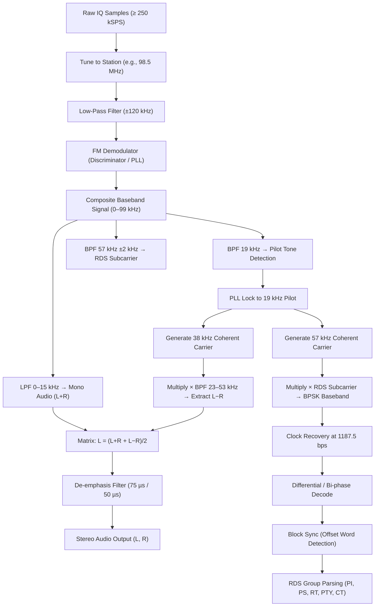

# Signal Specification: WBFM — Wideband FM Radio Broadcasting

Wideband FM (WBFM) radio broadcasting is the familiar analog "FM radio" that delivers music, talk, and emergency information to the public on the 88–108 MHz band worldwide. Think of it as a garden hose: instead of turning the water pressure up and down to encode a signal (AM), FM wiggles the hose side to side — the frequency swings back and forth around a center point, carrying audio in those wobbles. WBFM is almost certainly the first signal any SDR user will encounter, making it the "Hello World" of software-defined radio.

---

## 1. Physical Layer Parameters

| Parameter | Value |
|---|---|
| **Frequency Range** | 88–108 MHz (ITU Region 1, 2, & 3 — worldwide) |
| **Channel Spacing** | 200 kHz (Americas, Korea), 100 kHz (Europe, Australia, Japan) |
| **Modulation** | Analog Frequency Modulation (FM) |
| **Peak Deviation** | ±75 kHz |
| **Occupied Bandwidth** | ~200 kHz (Carson's rule: 2 × (75 kHz + 53 kHz) ≈ 256 kHz, practical 200 kHz) |
| **Mono Audio Bandwidth** | 30 Hz – 15 kHz |
| **Composite Baseband Bandwidth** | 30 Hz – 99 kHz (including HD Radio OFDM sidebands) |
| **Pre-emphasis (Tx) / De-emphasis (Rx)** | 75 µs (Americas, South Korea) / 50 µs (Europe, Australia, Japan, most others) |
| **Transmit Power** | 100 W – 100 kW ERP (typical), up to 200 kW ERP (US Class C) |
| **Polarization** | Circular (most US stations) or mixed H+V |

---

## 2. Composite Baseband Structure

The FM-demodulated baseband is a frequency-division multiplex carrying several subcarriers:

| Subcarrier / Component | Frequency Range | Description |
|---|---|---|
| **Mono Audio (L+R)** | 30 Hz – 15 kHz | Sum of left and right channels. Compatible with mono receivers. |
| **Stereo Pilot Tone** | 19.000 kHz | Unmodulated CW tone. Indicates stereo broadcast. Frequency reference for L−R demod. |
| **Stereo Difference (L−R)** | 23 – 53 kHz | DSB-SC AM modulated on 38 kHz (2× pilot). Center suppressed. |
| **RDS / RBDS** | 57 kHz (±2 kHz) | BPSK at 1187.5 bps on 3× pilot subcarrier. Station ID, program type, traffic. |
| **SCA (Subsidiary Comms)** | 67 kHz, 92 kHz | Narrowband FM subcarriers for background music services, reading services for the blind. |
| **HD Radio (IBOC)** | ±100 kHz – ±200 kHz from carrier | OFDM digital sidebands (COFDM, QPSK/16-QAM). Proprietary (Xperi). |

### Stereo Decoding
The 19 kHz pilot tone is the cornerstone of FM stereo:
1. Detect the 19 kHz pilot and phase-lock to it.
2. Generate a 38 kHz carrier (2× pilot) coherently.
3. Multiply the 23–53 kHz DSB-SC subcarrier by the regenerated 38 kHz carrier to extract L−R.
4. Combine: $L = \frac{(L+R) + (L-R)}{2}$, $R = \frac{(L+R) - (L-R)}{2}$.

### RDS (Radio Data System)
* **Subcarrier**: 57 kHz = 3 × 19 kHz pilot (phase-locked).
* **Modulation**: BPSK (bi-phase coded / Manchester-like), DSB-SC on the 57 kHz subcarrier.
* **Bit rate**: 1187.5 bps (= 19000 ÷ 16).
* **Block structure**: Groups of 4 blocks × 26 bits (16 data + 10 check/syndrome). Each group = 104 bits.
* **Group rate**: 11.4 groups/second.
* **Key data fields**:
  - **PI (Program Identification)**: Unique station code (country + coverage + reference).
  - **PS (Program Service)**: 8-character station name (e.g., `BBC_R_2_`).
  - **PTY (Program Type)**: Genre code (0–31).
  - **RT (RadioText)**: 64-character free-text message.
  - **CT (Clock Time)**: UTC date and time.
  - **TP/TA (Traffic)**: Traffic program / traffic announcement flags.
  - **AF (Alternative Frequencies)**: List of frequencies carrying the same program.

---

## 3. Synchronization & Frame Geometry

FM Broadcast is a continuous analog signal — there are no digital frames in the baseband audio path (unlike ACARS or AIS). However, the composite signal has implicit synchronization:

### Pilot Tone Synchronization
* The **19 kHz pilot tone** is always present during stereo broadcasts, providing:
  - **Stereo indication**: Presence/absence determines mono vs. stereo.
  - **Phase reference**: The pilot phase locks the 38 kHz and 57 kHz subcarrier recovery.
  - **Amplitude**: Typically 8–10% of total composite deviation (~±7.5 kHz deviation for pilot alone).

### RDS Block Synchronization
* RDS uses a **syndrome-based block sync** — each 26-bit block has a 10-bit checkword with an offset word (A, B, C/C', D) that identifies the block position within a group.
* Synchronization is achieved by scanning the bitstream for valid checkword/offset combinations across consecutive blocks.

### Timing Reference
* No discrete frame timing at the RF level — the FM signal is continuous.
* RDS group repetition: ~87.6 ms per group (1187.5 bps ÷ 104 bits).
* PS name fully decoded after receiving groups 0A/0B × 4 (8 characters, 2 per group) ≈ 350 ms minimum.

---

## 4. Demodulation & Decoding Pipeline

### 1. FM Demodulation
Apply a frequency discriminator to extract the instantaneous frequency deviation as the composite baseband signal:
$$x_{baseband}[n] = \frac{1}{2\pi} \frac{d}{dt} \angle s_{analytic}[n] \approx \frac{f_s}{2\pi} \cdot \text{arg}\left(s[n] \cdot s^*[n-1]\right)$$

### 2. Mono Extraction
Low-pass filter the composite at 15 kHz cutoff. Apply de-emphasis:
$$H_{de-emph}(f) = \frac{1}{1 + j 2\pi f \tau}, \quad \tau = 75\ \mu\text{s or } 50\ \mu\text{s}$$

### 3. Stereo Extraction
Bandpass filter around 19 kHz, PLL-lock, double the frequency, and coherently demodulate the DSB-SC L−R subcarrier.

### 4. RDS Extraction
Bandpass filter around 57 kHz ±2 kHz. Coherently demodulate using 3× the pilot phase. Recover the 1187.5 bps clock, differential-decode the bi-phase (Manchester-like) symbols, and synchronize to the block structure using offset word correlation.

---

## 5. HD Radio (IBOC) — Digital Companion

| Parameter | Value |
|---|---|
| **System** | HD Radio / IBOC (In-Band On-Channel), Xperi (formerly iBiquity) |
| **Modulation** | COFDM (QPSK in hybrid mode, 16-QAM/64-QAM in extended) |
| **Sidebands** | ±100 kHz to ±200 kHz from analog carrier center |
| **Digital Bandwidth** | ~400 kHz total (primary + extended sidebands) |
| **Audio Codec** | HE-AAC (HDC codec), 96 kbps typical main program |
| **Latency** | ~8 seconds (blend from analog to digital) |
| **Multicast** | HD2, HD3, HD4 subchannels supported |
| **Status** | Proprietary, US-only deployment (mostly) |

---

## 6. Companion Tools

| Tool | Description | Example CLI |
|---|---|---|
| **rtl_fm** | Command-line FM demodulator for RTL-SDR | `rtl_fm -M wbfm -f 98.5M -s 200k -r 48k \| aplay -r 48k -f S16_LE` |
| **GQRX** | Cross-platform SDR receiver with GUI | Open → set freq to 98.5 MHz, mode WFM, filter 200 kHz |
| **SDR#** | Windows SDR receiver (most popular for RTL-SDR) | GUI: select WFM mode, tune to desired station |
| **CubicSDR** | Cross-platform SDR app | GUI: WFM demod, any station in 88–108 MHz |
| **SoX** | Audio processing — apply de-emphasis offline | `sox input.raw -r 48000 -t raw -e signed -b 16 output.wav` |
| **redsea** | Lightweight RDS decoder | `rtl_fm -M fm -f 98.5M -s 171k \| redsea --feed-through` |
| **gr-rds** | GNU Radio RDS/RBDS decoder block | GNU Radio flowgraph with RDS Decoder block |
| **nrsc5** | Open-source HD Radio (IBOC) decoder | `nrsc5 -r rtl_sdr 98.5 0` |

---

## 7. Standards & References

* **ITU-R BS.450-3**: Transmission standards for FM sound broadcasting at VHF.
* **ITU-R BS.412-9**: Planning standards for FM sound broadcasting at VHF.
* **IEC 62106 / EN 50067**: Radio Data System (RDS) specification.
* **NRSC-4-B**: United States RBDS Standard (RBDS = North American RDS variant).
* **NRSC-5-D**: In-Band/On-Channel Digital Radio Broadcasting Standard (HD Radio).
* **FCC 47 CFR §73.317**: FM broadcast emission standards (United States).
* **ITU-R BS.641**: De-emphasis characteristics for FM broadcasting (50 µs / 75 µs).
* **Zenker, G. E. (1962)**: "FM Stereo Multiplex System" — original GE/Zenker stereo pilot-tone system adopted by FCC in 1961.
