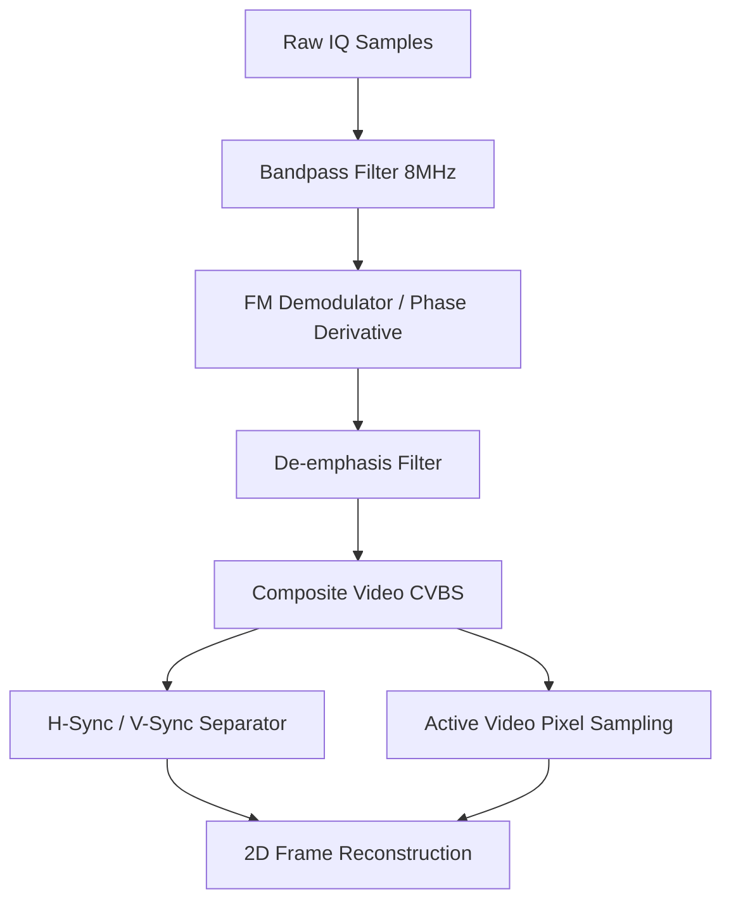

# Signal Specification: FPV Analog Video (PAL / NTSC)

Analog FPV (First Person View) video signals are used extensively in recreational and tactical drone systems due to their near-zero latency. The video signal consists of an analog composite baseband signal (CVBS) frequency-modulated onto a carrier in the 5.8 GHz band.

---

## 1. Physical Layer Parameters

* **Frequency Bands**: 5.8 GHz ISM (typically 5645 MHz to 5945 MHz, divided into bands A, B, E, F, R, L, and U).
* **Modulation**: Wideband Frequency Modulation (WFM).
* **FM Peak Deviation**: Typically 5.0 MHz.
* **Occupied Bandwidth**: ~20.0 MHz to 30.0 MHz (estimated by Carson's Rule: $B = 2(\Delta f + f_m)$).
* **Audio Subcarrier**: FM-modulated subcarrier multiplexed at 6.0 MHz or 6.5 MHz offset from the video carrier.
* **Temporal Pattern**: Continuous transmission (100% duty cycle, constant envelope).
* **PAPR**: Extremely low (~0.0 to 1.5 dB) due to constant amplitude FM modulation.

---

## 2. Synchronization & Frame Geometry

The composite baseband video signal (CVBS) uses specific amplitude thresholds and synchronization pulses to mark lines and frames.

### Horizontal Sync (H-Sync)
- Each video line begins with an H-Sync pulse (amplitude drops to the sync level, which is the lowest voltage).
- **PAL Sync Pulse**: $4.7\ \mu\text{s}$ duration, repeating every **$64.0\ \mu\text{s}$** (Line frequency = 15.625 kHz).
- **NTSC Sync Pulse**: $4.7\ \mu\text{s}$ duration, repeating every **$63.556\ \mu\text{s}$** (Line frequency = 15.734 kHz).

### Vertical Sync (V-Sync)
- Indicates the end of a video field and start of the next.
- **PAL**: 50 fields per second (25 frames/s, interlaced).
- **NTSC**: 59.94 fields per second (29.97 frames/s, interlaced).

---

## 3. Demodulation & CVBS Extraction Pipeline

### 1. FM Demodulation
Extract the phase derivative of the complex baseband samples $s[n]$ to recover the composite video baseband signal $v[n]$:
$$\phi[n] = \angle(s[n] \cdot s^*[n-1])$$
$$v[n] = \frac{\phi[n]}{2\pi \cdot K_f \cdot T_s}$$
where $K_f$ is the FM modulator constant and $T_s$ is the sampling interval.

### 2. Line Synchronization separator
Locate the periodic H-sync drops in $v[n]$. By correlating the raw demodulated signal with a $4.7\ \mu\text{s}$ square pulse, sync locks can be established. 
- A cyclic correlation check over a search range of 63 to 65 microseconds can discriminate PAL from NTSC:
  - If cyclic correlation peaks at **$64.0\ \mu\text{s}$**, standard is **PAL**.
  - If cyclic correlation peaks at **$63.56\ \mu\text{s}$**, standard is **NTSC**.
