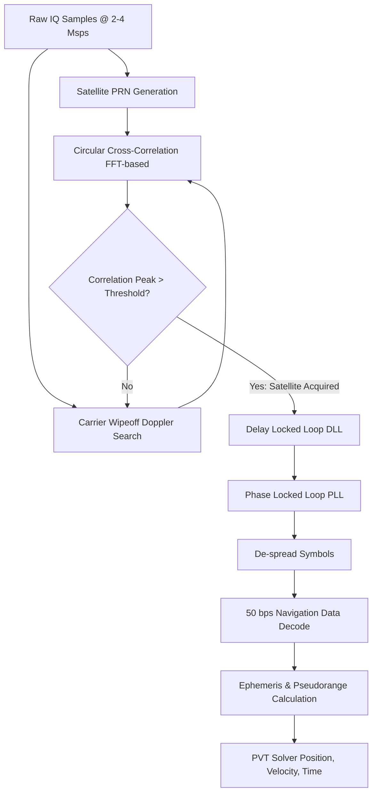

# Signal Specification: GPS / GNSS (Satellite Navigation)

Global Navigation Satellite Systems (GNSS) including the US Global Positioning System (GPS), European Galileo, Russian GLONASS, and Chinese BeiDou provide worldwide PNT (Position, Navigation, and Timing) services. These signals are unique in SDR analysis because they are transmitted by MEO (Medium Earth Orbit) satellites at power levels so low that the signal arrives on Earth *below* the thermal noise floor. You cannot "see" a GPS signal on a standard waterfall or spectrum analyzer; it must be extracted using complex correlation against known codes.

---

## 1. Physical Layer Parameters (GPS L1 C/A)

While there are many signals and bands, the most common entry point for SDR research is the GPS L1 Coarse/Acquisition (C/A) code.

* **Center Frequency**: 1575.42 MHz (L1 Band)
* **Modulation**: BPSK (Binary Phase Shift Keying) with CDMA (Code Division Multiple Access)
* **Spreading Code**: Gold Codes (PRN - Pseudo-Random Noise codes).
  * Each satellite has a unique 1,023-bit sequence.
  * The code repeats every 1 millisecond.
* **Chipping Rate**: 1.023 Mcps (Mega-chips per second).
* **Main Lobe Bandwidth**: 2.046 MHz (null-to-null bandwidth of the BPSK main lobe).
* **Navigation Message Data Rate**: 50 bps.
  * A single data bit lasts 20 ms, spanning 20 full repetitions of the 1 ms PRN code.
* **Received Signal Strength**: Typically -125 dBm to -130 dBm (well below the typical ambient thermal noise floor of ~-110 dBm for a 2 MHz bandwidth).

### Other Notable Constellations/Bands
* **GPS L2**: 1227.60 MHz
* **GPS L5**: 1176.45 MHz (faster chipping rate, wider 20 MHz bandwidth)
* **Galileo E1**: 1575.42 MHz (shares the L1 band, uses BOC(1,1) modulation instead of BPSK, creating a split-spectrum appearance)
* **GLONASS L1**: 1598.0625 to 1605.375 MHz (Uses FDMA instead of pure CDMA; each satellite transmits on a different frequency: $1602 + k \times 0.5625$ MHz, BPSK at 0.511 Mcps).

---

## 2. Synchronization & Processing Geometry

Because the signal is below the noise floor, it must be "de-spread" to be detected.

1. **Acquisition (2D Search)**:
   * The receiver does not know which satellites are visible, nor their exact Doppler shift (due to orbital motion, up to ±5 kHz), nor the time alignment of the 1 ms PRN code.
   * The receiver performs a 2D search (Code Phase vs. Doppler Frequency) for every possible satellite PRN.
   * This is typically done efficiently using FFT-based circular correlation.
   * If a correlation peak is found that exceeds the noise floor by a sufficient threshold, the satellite is "acquired."

2. **Tracking**:
   * Once acquired, the receiver hands the code phase and Doppler shift over to tracking loops.
   * **DLL (Delay Locked Loop)**: Tracks the code phase (Early/Prompt/Late correlators).
   * **PLL (Phase Locked Loop) / FLL (Frequency Locked Loop)**: Tracks the carrier phase and frequency.

3. **Navigation Data Extraction**:
   * With the signal de-spread and carrier wiped off, the 50 bps BPSK navigation message (ephemeris, almanac, time) can be decoded.

---

## 3. Demodulation Pipeline (Software Receiver)

---

## 4. Companion Tools

| Tool | Platform | Description |
|---|---|---|
| **GNSS-SDR** | Linux/macOS | The premier open-source software-defined GNSS receiver. Takes raw IQ and outputs real-time position fixes. |
| **SoftGNSS** | MATLAB/Octave | A classic academic MATLAB implementation for learning GPS SDR architecture. |
| **gps-sdr-sim** | CLI | A tool that *generates* raw IQ data containing simulated GPS L1 C/A signals (used for SDR transmitting / spoofing research). |
| **kalibrate-rtl** | CLI | Primarily used for GSM, but GNSS disciplines are often used to calibrate SDR oscillator ppm offset. |

---

## 5. Standards & References
* **IS-GPS-200**: Navstar GPS Space Segment/Navigation User Interfaces.
* **Understanding GPS: Principles and Applications** (Kaplan & Hegarty): Standard reference text.
