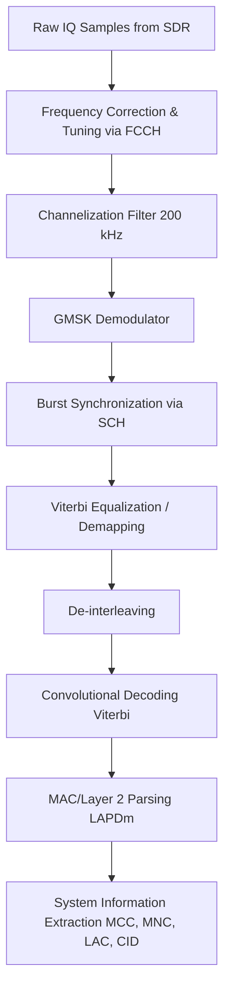

# Signal Specification: GSM 2G Cellular

Global System for Mobile Communications (GSM) is the foundational 2G cellular standard. While largely sunset in North America and parts of Europe, it remains active in many regions globally and is a very common SDR target for security research and Capture The Flag (CTF) events due to its well-understood architecture and open-source decoding tooling.

---

## 1. Physical Layer Parameters

* **Frequency Bands**:
  * **GSM-850**: 824–849 MHz (Uplink), 869–894 MHz (Downlink)
  * **E-GSM-900**: 880–915 MHz (Uplink), 925–960 MHz (Downlink) — Most common in EU/Asia
  * **DCS-1800**: 1710–1785 MHz (Uplink), 1805–1880 MHz (Downlink)
  * **PCS-1900**: 1850–1910 MHz (Uplink), 1930–1990 MHz (Downlink)
* **Channel Spacing**: 200 kHz (ARFCN - Absolute Radio Frequency Channel Number)
* **Modulation**: GMSK (Gaussian Minimum Shift Keying)
  * BT = 0.3 (Gaussian filter bandwidth-time product)
* **Data Rate**: 270.833 kbps (Symbol rate = 270.833 kbaud)
* **Duplexing**: FDD (Frequency Division Duplexing)

---

## 2. Synchronization & Frame Geometry

GSM uses TDMA (Time Division Multiple Access) on top of FDMA (Frequency Division Multiple Access).

* **TDMA Frame**: 1 frame = 8 time slots (TS0 to TS7).
* **Frame Duration**: 4.615 ms (120/26 ms).
* **Time Slot Duration**: 0.577 ms (15/26 ms).
* **Bits per Time Slot**: 156.25 bits.

### Logical Channels

GSM defines many logical channels mapped onto the physical time slots. The most important for SDR passive intelligence gathering are the broadcast channels, which are sent in the clear (unencrypted) and typically found on Time Slot 0 (TS0) of a base station's primary ARFCN (the "beacon" channel).

1. **FCCH (Frequency Correction Channel)**:
   * A burst of all '0's (which in GMSK translates to a pure continuous sine wave offset by +67.7 kHz from the carrier center).
   * Used by mobile phones (and SDRs) to easily find a GSM base station and synchronize frequency.
2. **SCH (Synchronization Channel)**:
   * Carries the Base Station Identity Code (BSIC) and current frame number.
   * Contains a long training sequence for precise timing synchronization.
3. **BCCH (Broadcast Control Channel)**:
   * Carries network identity (MCC, MNC), cell identity (CID), Location Area Code (LAC), and configuration parameters.
   * This is the primary target for metadata extraction using tools like `gr-gsm`.

---

## 3. Demodulation Pipeline

---

## 4. Companion Tools

| Tool | Platform | Description |
|---|---|---|
| **gr-gsm** | Linux | The standard GNU Radio blocks and tools for receiving GSM. |
| **grgsm_livemon** | CLI (GUI) | A gr-gsm utility that provides a live view of the BCCH and outputs decoded bursts to UDP. |
| **kalibrate-rtl** (kal) | CLI | Uses the FCCH tone to calculate SDR frequency offset and find active GSM base stations. |
| **Wireshark** | GUI | Combined with grgsm_livemon, Wireshark can parse the GSMTAP UDP packets to show full BCCH System Information decodes. |
| **srsRAN** | Linux | Software radio suite for 4G/5G, but conceptually related to cellular SDR research. |

> **⚠️ Legal Warning**: Decoding the BCCH (Broadcast Control Channel) is generally considered passive observation of public metadata. However, capturing or decrypting Voice/SMS traffic (TCH/SDCCH) or tracking user identifiers (IMSI) without authorization is strictly illegal in most jurisdictions.

---

## 5. Standards & References
* **3GPP TS 05.02**: GSM/EDGE Multiplexing and multiple access on the radio path.
* **3GPP TS 05.04**: GSM/EDGE Modulation.
* **OsmocomBB**: Open source GSM baseband software.
