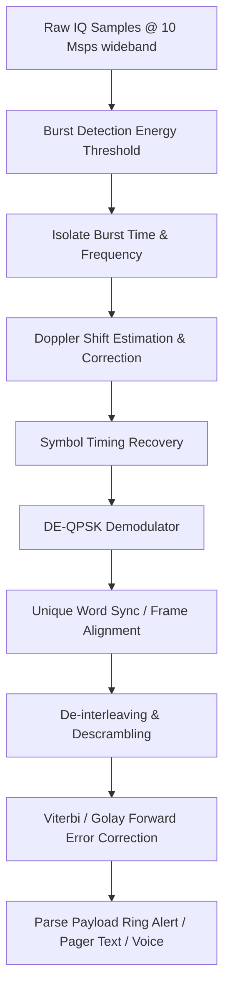

# Signal Specification: Iridium Satellite Constellation

Iridium is a commercial satellite communications network providing global voice and data coverage. It uses a constellation of 66 active Low Earth Orbit (LEO) satellites in polar orbits. Because the satellites are in LEO (moving very fast relative to the Earth's surface) and communicate directly with handsets on the ground, the signals are strong enough to be easily received by simple SDRs with a patch antenna, making it a very popular SDR target.

---

## 1. Physical Layer Parameters

* **Frequency Band**: 1616.0 to 1626.5 MHz (L-Band)
* **Duplexing**: TDD (Time Division Duplexing)
* **Multiple Access**: FDMA/TDMA (Frequency and Time Division)
* **Channel Spacing**: 41.667 kHz spacing, but the actual occupied bandwidth is ~31.5 kHz.
* **Modulation**: DE-QPSK (Differentially Encoded Quadrature Phase Shift Keying)
  * Uplink and downlink use the same modulation.
* **Symbol Rate**: 25 ksps (kilo-symbols per second)
* **Data Rate**: 50 kbps (gross)
* **Doppler Shift**: Because the satellites are in LEO, signals experience a significant Doppler shift (up to ±37 kHz over a 10-minute pass).

---

## 2. Synchronization & Frame Geometry

Iridium uses a complex TDMA frame structure.

* **Frame Duration**: 90 ms
* **Time Slots**: Each frame is divided into 4 downlink time slots and 4 uplink time slots, separated by a guard time.
* **Burst Types**:
  1. **Simplex Downlink**: 
     * Broadcast channels that carry Ring Alerts (paging the handset) and messaging (short burst data).
     * Only transmitted by the satellite (no corresponding uplink slot).
     * This is the primary target for SDR hobbyist decoding.
  2. **Duplex Channels**:
     * Used for active voice calls or data sessions.
     * Hopping: The duplex channels frequency-hop across the 1616-1626 MHz band.

### The Ring Alert Channel
* Located in a specific sub-band (usually around 1626.27 MHz).
* The satellite broadcasts "Ring Alerts" here. If someone calls an Iridium phone, the satellite pages the phone's unique ID on this channel so the phone wakes up and initiates a duplex connection.
* It is a simplex channel, easily captured by holding an SDR on that specific frequency.

---

## 3. Demodulation Pipeline

Decoding Iridium requires handling large, fast-moving Doppler shifts and extracting tiny TDMA bursts.

---

## 4. Companion Tools

| Tool | Platform | Description |
|---|---|---|
| **iridium-toolkit** | Linux/macOS | The de facto standard open-source suite. Consists of `gr-iridium` (a GNU Radio flowgraph that extracts DE-QPSK symbols from raw IQ) and `iridium-parser` (a Python script that parses the symbols into messages). |
| **re-iridium** | Linux | A complete C++ re-implementation of iridium-toolkit, optimized for performance and real-time decoding. |

---

## 5. Standards & References
* **Iridium System Documentation**: Official specs are proprietary, but the protocol has been extensively reverse-engineered.
* **SecT / Chaos Computer Club**: Much of the open-source Iridium tooling stems from security research presented at CCC (e.g., Schneider & O'Neill).
