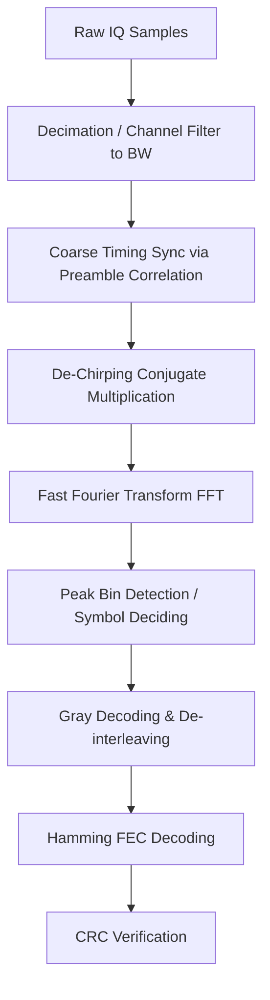

# Signal Specification: LoRa (Chirp Spread Spectrum)

LoRa (Long Range) is a proprietary, low-power wide-area network (LPWAN) protocol developed by Cycleo (acquired by Semtech). It utilizes Chirp Spread Spectrum (CSS) modulation to achieve long-range communication and high interference robustness.

---

## 1. Physical Layer Parameters

* **Frequency Bands**: 
  - Sub-GHz ISM: 433 MHz (Asia/ITU Region 3, some EU), 868 MHz (Europe), 915 MHz (North America/Australia)
  - 2.4 GHz ISM (LoRa 2.4GHz standard)
* **Standard Bandwidths (BW)**: 
  - Sub-GHz: 125 kHz, 250 kHz, 500 kHz
  - 2.4 GHz: 200 kHz, 400 kHz, 800 kHz, 1600 kHz
* **Modulation**: Chirp Spread Spectrum (CSS)
* **Spreading Factor (SF)**: SF6 to SF12
  - Denotes the number of bits encoded per symbol.
  - A symbol consists of $2^{SF}$ chips.
* **Symbol Duration ($T_{sym}$)**: 
  - $T_{sym} = \frac{2^{SF}}{BW}$
  - Example: SF7 at 125 kHz BW has a symbol duration of $2^7 / 125000 = 1.024\ \text{ms}$.
* **Chirp Behavior**: 
  - **Up-chirp**: Frequency sweeps linearly from $f_c - BW/2$ to $f_c + BW/2$.
  - **Down-chirp**: Frequency sweeps linearly from $f_c + BW/2$ to $f_c - BW/2$.

---

## 2. Synchronization & Frame Geometry

A standard LoRa packet contains a preamble, sync word, start-of-frame delimiter (SFD), header (optional), payload, and CRC.

```
| Preamble (8-10.25 Up-Chirps) | Sync Word (2 Up-Chirps) | SFD (2.25 Down-Chirps) | Header | Payload | CRC |
```

### Preamble
- Consists of $N_{prog}$ (default 8) continuous unmodulated up-chirps.
- Used by the receiver for timing synchronization and coarse frequency offset estimation.

### Start of Frame Delimiter (SFD)
- Consists of 2.25 down-chirps immediately following the sync word.
- Signals the precise start of the payload data.

---

## 3. Demodulation & Decoding Pipeline



### De-Chirping Demodulation
1. **Generate Reference Down-Chirp**:
   A baseband reference down-chirp $c_{ref}^*[t]$ is generated for the duration of one symbol $T_{sym}$:
   $$c_{ref}[t] = e^{j 2 \pi \left( -\frac{BW}{2}t + \frac{BW}{2 \cdot T_{sym}} t^2 \right)}$$
2. **Conjugate Multiplication**:
   Multiply each received symbol window $r[t]$ by the conjugate reference up-chirp (which acts as a down-chirp):
   $$y[t] = r[t] \cdot c_{ref}^*[t]$$
3. **FFT Peak Spectral Extraction**:
   Perform a $2^{SF}$-point FFT on $y[t]$. The multiplication removes the linear quadratic phase slope of the chirp. Any frequency offset (the start offset of the chirp coding the symbol) is converted into a constant frequency tone, creating a sharp single peak in the FFT spectrum.
   $$Y[k] = \text{FFT}(y[t])$$
   $$\text{Symbol} = \arg\max_{k} |Y[k]|$$
