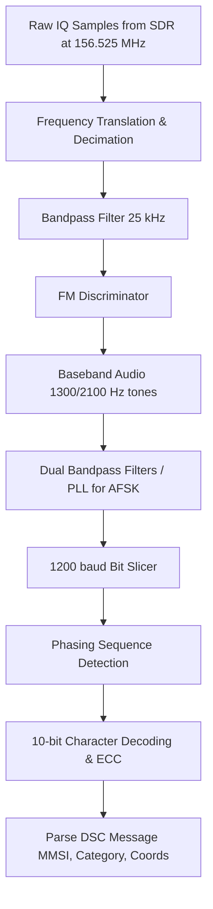

# Signal Specification: Marine VHF Radio

Marine VHF radio is a worldwide system of two-way radio transceivers on ships and watercraft used for bidirectional voice communication from ship-to-ship, ship-to-shore (e.g., with harbormasters), and in certain circumstances ship-to-aircraft. It is an internationally standardized system with fixed channel allocations.

---

## 1. Physical Layer Parameters

* **Frequency Band**: 156.000 to 162.025 MHz (VHF)
* **Channel Spacing**: 25 kHz (standard), with some 12.5 kHz interleaved channels.
* **Modulation**: Narrowband Frequency Modulation (NBFM)
  * **Voice Deviation**: ±5 kHz
* **Duplexing**: 
  * Most ship-to-ship is simplex (same frequency for TX and RX).
  * Some ship-to-shore is half-duplex (ship transmits on one frequency, listens on another, usually offset by +4.6 MHz).
* **Transmit Power**:
  * Fixed mounts: 25 Watts (High) or 1 Watt (Low - required for harbor use).
  * Handhelds: Typically 5-6 Watts (High) or 1 Watt (Low).

### Notable Channels
* **Channel 16 (156.800 MHz)**: International Distress, Safety, and Calling frequency. By maritime law, all vessels equipped with VHF must monitor this channel.
* **Channel 70 (156.525 MHz)**: Dedicated exclusively to Digital Selective Calling (DSC). No voice allowed.
* **Channels 87B/88B (161.975 / 162.025 MHz)**: Dedicated to AIS (Automatic Identification System) for ship tracking. (See the separate `ais` signal spec for details).

---

## 2. Digital Selective Calling (DSC)

While most marine VHF is analog voice, DSC on Channel 70 allows radios to page each other digitally, similar to a pager or an SMS message. It is a core component of the Global Maritime Distress and Safety System (GMDSS). A DSC radio connected to a GPS can broadcast an automated "Mayday" packet with exact coordinates at the push of a red button.

* **Frequency**: 156.525 MHz (Ch 70)
* **Modulation**: AFSK (Audio Frequency Shift Keying) on an FM carrier.
* **Tones**:
  * Space (0) = 2100 Hz
  * Mark (1) = 1300 Hz
* **Data Rate**: 1200 baud
* **Encoding**: 10-bit error-detecting character code.
* **Information Carried**: MMSI (Maritime Mobile Service Identity) of the sender and target, category (Distress, Urgency, Safety, Routine), and GPS coordinates.

---

## 3. Demodulation Pipeline (DSC Channel 70)

---

## 4. Companion Tools

| Tool | Platform | Description |
|---|---|---|
| **rtl_fm** | CLI | For listening to voice: `rtl_fm -f 156.800M -M fm -s 22000 -r 48000 - | play -t raw -r 48000 -e s -b 16 -c 1 -V1 -` |
| **GQRX** | GUI | Standard SDR visualizer, excellent for monitoring marine VHF and dropping squelch. |
| **multimon-ng** | CLI | Can decode the DSC AFSK bursts: `rtl_fm -f 156.525M -M fm -s 22000 - | multimon-ng -a DSC -` |
| **rtl_ais** | CLI | Dedicated tool for the two AIS digital channels (see AIS entry). |

---

## 5. Standards & References
* **ITU-R M.489-2**: Technical characteristics of VHF radiotelephone equipment operating in the maritime mobile service.
* **ITU-R M.493-15**: Digital selective-calling system for use in the maritime mobile service.
