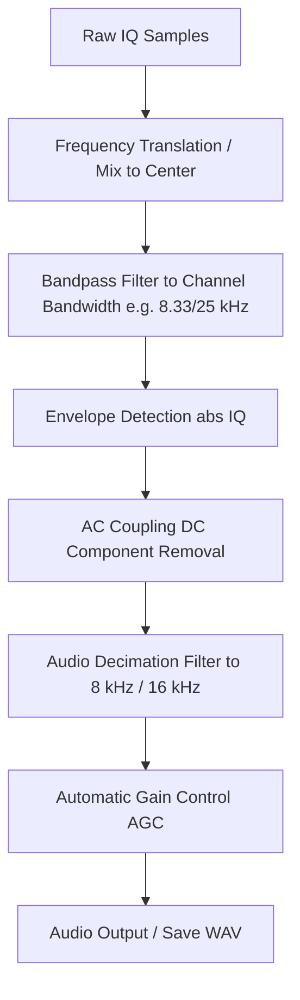

# Modulation Specification: Amplitude Modulation (AM)

Amplitude Modulation (AM) is a basic analog modulation technique where the amplitude of a high-frequency carrier wave is varied in proportion to the instantaneous amplitude of the modulating message signal (e.g. voice/audio).

---

## 1. Physical Layer Parameters

* **Frequency Bands**:
  * AM Broadcast: `530 kHz to 1700 kHz`
  * VHF Aviation Air Band: `118 MHz to 137 MHz`
  * Shortwave radio bands
* **Standard Channel Bandwidths**:
  * AM Broadcast: `10 kHz` (US) or `9 kHz` (Europe)
  * VHF Air Band: `25 kHz` or `8.33 kHz` channel spacing
* **Modulation Type**: Analog Amplitude Modulation
* **Mathematical Representation**:
  $$s(t) = [A_c + m(t)] \cos(2 \pi f_c t)$$
  Where $A_c$ is the carrier amplitude and $m(t)$ is the audio message signal.

---

## 2. Demodulation & Decoding Pipeline (VHF Air Band AM)

AM demodulation from complex baseband IQ samples involves recovering the envelope amplitude and removing the DC carrier level.

### 1. Envelope Detection
The amplitude envelope is recovered by computing the absolute magnitude of the complex baseband samples:
$$e[n] = |x[n]| = \sqrt{I[n]^2 + Q[n]^2}$$

### 2. AC Coupling (DC Removal)
The unmodulated carrier wave produces a constant DC offset in the recovered envelope. To extract only the AC audio signal, the average value is subtracted:
$$y_{ac}[n] = e[n] - \text{Mean}(e)$$

### 3. Decimation & Audio Filtering
The sample rate is decimated down to standard audio rates (e.g. `8 kHz` for voice or `48 kHz` for hi-fi audio). Decimation filters out high-frequency noise outside the audio band.

---

## 3. LLM Triage Hints (VHF Air Band AM)

* **Occupied Bandwidth**: Strictly `6 kHz to 10 kHz` centered inside a `25 kHz` or `8.33 kHz` channel spacing window.
* **PAPR (Peak-to-Average Power Ratio)**: Unlike constant-envelope FSK/FM, AM signals have high PAPR (typically `4 dB to 8 dB` depending on the modulation depth and audio content).
* **Amplitude Coefficient of Variation (Std/Mean)**: Significant amplitude fluctuations (typically `0.1 to 0.4`), reflecting the modulating voice waveform.
* **Temporal Pattern**: Continuous streaming signal while the push-to-talk (PTT) is active.
