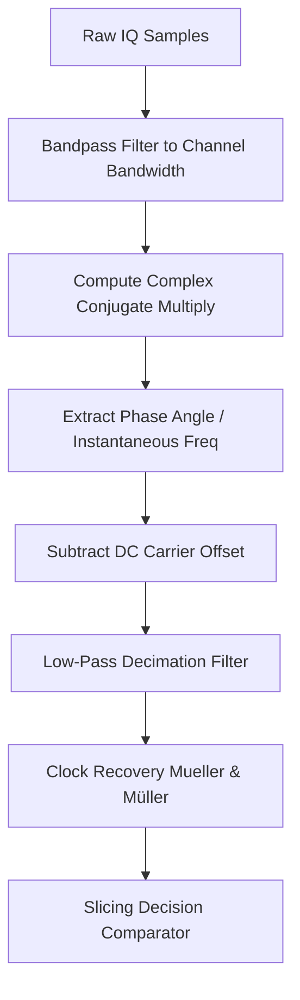

# Modulation Specification: FSK / GFSK (Frequency Shift Keying)

Frequency Shift Keying (FSK) is a digital modulation scheme in which the frequency of the carrier wave is varied in accordance with the digital signal. Gaussian FSK (GFSK) passes the data through a Gaussian filter before modulation to smooth the frequency transitions, reduce sideband spectral energy, and limit occupied bandwidth. GFSK is the core modulation for Bluetooth, BLE, POCSAG pagers, Zigbee (some bands), and Sub-GHz RF links.

---

## 1. Mathematical Formulation

The modulated continuous-phase FSK signal $s(t)$ is expressed as:
$$s(t) = A \cdot \cos\left(2\pi f_c t + \theta(t) + \phi_0\right)$$

The instantaneous phase term $\theta(t)$ is the integral of the frequency modulating signal:
$$\theta(t) = 2\pi \Delta f \int_{-\infty}^{t} g(\tau) d\tau$$
where:
* $\Delta f$ is the **peak frequency deviation**.
* $g(t)$ is the pulse-shaped data stream. For GFSK, $g(t) = m(t) * h_G(t)$, where $h_G(t)$ is a Gaussian filter impulse response:
  $$h_G(t) = \frac{\sqrt{\pi}}{\alpha} \cdot e^{-\left(\frac{\pi t}{\alpha}\right)^2}$$
  with parameter $\alpha$ related to the filter bandwidth.

### Modulation Index ($h$)
The modulation index characterizes the spectral properties of the FSK signal:
$$h = \frac{2 \Delta f}{R_{sym}}$$
where $R_{sym}$ is the symbol rate. When $h=0.5$, the scheme is Minimum Shift Keying (MSK) or GMSK (used in GSM cellular).

---

## 2. Demodulation Pipeline (Step-by-Step)



### 1. Quadrature Phase Discriminator (FM Demodulator)
To extract the instantaneous frequency from the complex baseband samples $x[n]$, compute the phase angle of the product of the current sample and the conjugate of the previous sample:
$$\Delta \phi[n] = \angle\left(x[n] \cdot x^*[n-1]\right)$$
$$\Delta \phi[n] = \text{atan2}\left(\text{Im}(x[n] \cdot x^*[n-1]),\ \text{Re}(x[n] \cdot x^*[n-1])\right)$$

This phase difference is directly proportional to the instantaneous frequency:
$$f_{inst}[n] = \frac{\Delta \phi[n] \cdot f_s}{2\pi}$$
where $f_s$ is the sample rate.

### 2. Carrier Offset Correction
Subtract any DC carrier offset caused by receiver tuning error:
$$y[n] = f_{inst}[n] - \text{mean}(f_{inst})$$

### 3. Slicing Decision
For binary 2-FSK, slice the corrected frequency wave $y[n]$ to retrieve the digital states:
$$d[n] = \begin{cases} 1 & \text{if } y[n] > 0 \\ 0 & \text{if } y[n] \le 0 \end{cases}$$
For 4-FSK, compare $y[n]$ against three slicing thresholds to recover 2 bits per symbol.

### 4. Simple Symbol Clock Recovery (Decimation)
To sample the frequency signal at the exact center of each symbol duration (where the eyes are open and frequency is stable), use a **variance-maximization search** over the symbol period $N_{sp} = f_s / R_{sym}$:
```python
# samples_per_symbol (N_sp) represents the number of samples in one bit interval
best_offset = 0
max_variance = 0

for offset in range(samples_per_symbol):
    # Sample the signal at this phase offset
    sampled = demod_signal[offset::samples_per_symbol]
    # The optimal sampling point maximizes the distance between the two FSK frequency states (+df and -df),
    # which maximizes the mathematical variance of the sampled points.
    var = np.var(sampled)
    if var > max_variance:
        max_variance = var
        best_offset = offset

# Extract the symbols at the optimal offset
sliced_symbols = demod_signal[best_offset::samples_per_symbol]
bits = (sliced_symbols > 0).astype(int)
```
This algorithm is computationally light, self-contained, and highly effective for processing packetized captures.
