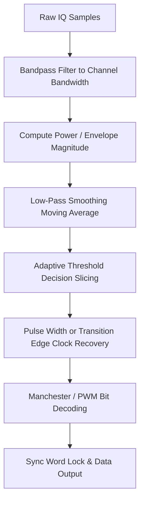

# Modulation Specification: OOK / ASK (Amplitude Shift Keying)

Amplitude Shift Keying (ASK) is a digital modulation scheme that represents binary data as variations in the amplitude of a carrier wave. On-Off Keying (OOK) is the simplest, most common form of ASK, where the carrier is keyed on for a '1' bit and off for a '0' bit. It is widely used in low-power consumer devices like garage door openers, car fobs, weather sensors, and TPMS.

---

## 1. Mathematical Formulation

The modulated bandpass signal $s(t)$ is expressed as:
$$s(t) = a(t) \cdot \cos(2\pi f_c t + \phi_0)$$

For binary ASK, the amplitude signal $a(t)$ maps to:
* **ASK**: $a(t) \in \{A_0, A_1\}$ where $A_0 \neq A_1 \neq 0$.
* **OOK**: $a(t) \in \{0, A\}$ where the carrier is completely suppressed for '0'.

---

## 2. Common Pulse Encoding Schemas

Raw binarized waveforms are rarely encoded as raw NRZ bits directly. To prevent clock drift, one of the following schemas is typically applied:

### 1. Manchester Encoding
* **Definition**: Every bit has a transition in the exact middle of the bit period.
  - A **'1'** is represented by a **high-to-low** transition (falling edge) or **low-to-high** depending on the standard (IEEE 802.3 vs G.E. Thomas).
  - A **'0'** is represented by the opposite transition.
* **Benefit**: Self-clocking, ensures a 50% DC balance.

### 2. Pulse Width Modulation (PWM)
* **Definition**: The duty cycle of each pulse determines the bit value.
  - A **'1'** is a **long pulse** followed by a short space.
  - A **'0'** is a **short pulse** followed by a long space.
* **Usage**: Extremely common in Sub-GHz 433.92 MHz garage door openers and wireless power switches.

---

## 3. Demodulation Pipeline (Step-by-Step)

### 1. Envelope Detection
Compute the magnitude envelope of the complex baseband samples $x[n]$:
$$m[n] = |x[n]| = \sqrt{I[n]^2 + Q[n]^2}$$
This extracts the amplitude variations, removing the carrier phase and frequency offsets.

### 2. Low-Pass Smoothing Filter
Apply a moving average filter to smooth high-frequency noise spikes in the envelope:
$$y[n] = \frac{1}{W} \sum_{k=0}^{W-1} m[n-k]$$
where $W$ is approximately $10\%$ to $20\%$ of the symbol duration in samples.

### 3. Slicing with Adaptive Thresholding
To convert the analog envelope $y[n]$ to digital binary state $d[n]$, set a slicing threshold $\theta$. To handle signal fading, use a dynamic adaptive threshold:
$$\theta[n] = \frac{\max(y[n-N:n]) + \min(y[n-N:n])}{2}$$
$$d[n] = \begin{cases} 1 & \text{if } y[n] > \theta[n] \\ 0 & \text{if } y[n] \le \theta[n] \end{cases}$$
where $N$ spans multiple symbol periods.
