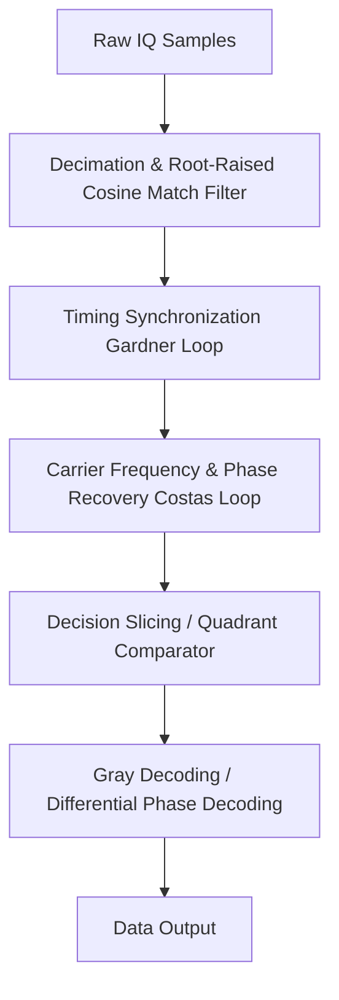

# Modulation Specification: PSK (Phase Shift Keying)

Phase Shift Keying (PSK) is a digital modulation scheme that conveys data by changing (modulating) the phase of a constant-frequency carrier wave. The amplitude and frequency remain constant. PSK is widely used in GPS, satellite communications, Wi-Fi preambles, and Zigbee.

---

## 1. Mathematical Formulation & Constellations

The modulated signal is represented as:
$$s(t) = A \cdot \cos\left(2\pi f_c t + \phi(t)\right)$$

The phase term $\phi(t)$ takes on one of $M$ discrete values representing symbols:
$$\phi_k = \frac{2\pi k}{M} + \theta_0, \quad k \in \{0, 1, \dots, M-1\}$$

### 1. BPSK (Binary PSK, $M=2$)
* **Constellation**: 2 points separated by $180^\circ$ ($\pi$ radians).
* **Phases**: $\{0, \pi\}$
* **Efficiency**: 1 bit per symbol.

### 2. QPSK (Quadrature PSK, $M=4$)
* **Constellation**: 4 points spaced at $90^\circ$ ($\pi/2$ radians) intervals.
* **Phases**: $\{\pi/4, 3\pi/4, 5\pi/4, 7\pi/4\}$ (often mapped to gray codes).
* **Efficiency**: 2 bits per symbol.

### 3. Differential PSK (DPSK)
* **Definition**: Data is encoded as the *difference* in phase between consecutive symbols ($\Delta \phi_n = \phi_n - \phi_{n-1}$) rather than absolute phase.
* **Benefit**: Eliminates the need for absolute carrier phase recovery at the receiver.

---

## 2. Demodulation Pipeline (Step-by-Step)

### 1. Carrier Phase Recovery (Squaring Loop / Costas Loop)
Because PSK phase offsets are relative to the carrier phase, any carrier frequency offset ($f_{off}$) will cause the constellation to rotate continuously:
$$y[n] = x[n] \cdot e^{-j 2\pi f_{off} n T_s}$$

To track and remove $f_{off}$, receivers use a **Costas Loop** or **Squaring Loop**:
* **BPSK Squaring**: Squaring the complex samples $r[n]^2$ doubles the phase offsets. Since $e^{j 2 \cdot 0} = 1$ and $e^{j 2 \cdot \pi} = 1$, the modulation is removed, leaving a pure tone at $2 \cdot f_{off}$ which can be locked via a standard PLL.
* **QPSK 4th Power**: Raising QPSK samples to the 4th power $r[n]^4$ removes the QPSK modulation, leaving a tone at $4 \cdot f_{off}$.

### 2. Decision Slicing
Once phase-aligned to the reference axes:
* **BPSK Slicing**:
  $$d[n] = \begin{cases} 1 & \text{if } \text{Re}(y[n]) > 0 \\ 0 & \text{if } \text{Re}(y[n]) \le 0 \end{cases}$$
* **QPSK Slicing**:
  $$b_{even}[n] = \begin{cases} 1 & \text{if } \text{Re}(y[n]) > 0 \\ 0 & \text{if } \text{Re}(y[n]) \le 0 \end{cases}$$
  $$b_{odd}[n] = \begin{cases} 1 & \text{if } \text{Im}(y[n]) > 0 \\ 0 & \text{if } \text{Im}(y[n]) \le 0 \end{cases}$$
* **DPSK Demodulation (Alternative without PLL)**:
  Multiply the current sample by the conjugate of the previous sample to extract the phase difference:
  $$d_{diff}[n] = y[n] \cdot y^*[n-1]$$
  Slice $d_{diff}[n]$ based on its quadrant location.
