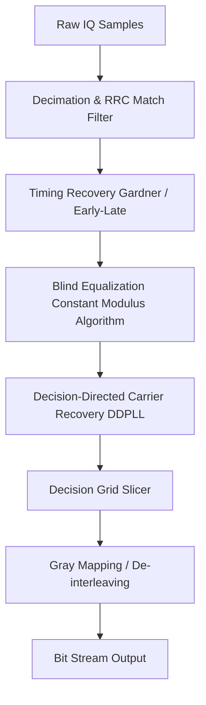

# Modulation Specification: QAM (Quadrature Amplitude Modulation)

Quadrature Amplitude Modulation (QAM) is both an analog and a digital modulation scheme. It conveys two analog message signals, or two digital bit streams, by modulating the amplitudes of two carrier waves (in-phase $I$ and quadrature $Q$) that are $90^\circ$ out of phase. Digital QAM (e.g. QAM-16, QAM-64) is the backbone of high-throughput protocols like Wi-Fi (802.11), LTE/5G, and cable television.

---

## 1. Mathematical Formulation & Constellations

The modulated signal $s(t)$ is expressed as:
$$s(t) = I(t) \cdot \cos(2\pi f_c t) - Q(t) \cdot \sin(2\pi f_c t)$$

Alternatively, in complex baseband form:
$$s_{bb}(t) = I(t) + j Q(t)$$

### 1. QAM-16 (16 discrete states, 4 bits/symbol)
* **Constellation**: A $4 \times 4$ rectangular grid.
* **Coordinate Mapping**: $I(t), Q(t) \in \{-3, -1, 1, 3\} \cdot A$
* **Slicing Boundaries**: Thresholds lie at $\{-2, 0, 2\} \cdot A$.

### 2. QAM-64 (64 discrete states, 6 bits/symbol)
* **Constellation**: An $8 \times 8$ rectangular grid.
* **Coordinate Mapping**: $I(t), Q(t) \in \{-7, -5, -3, -1, 1, 3, 5, 7\} \cdot A$
* **Slicing Boundaries**: Thresholds lie at $\{-6, -4, -2, 0, 2, 4, 6\} \cdot A$.

---

## 2. Demodulation Pipeline (Step-by-Step)

### 1. Channel Equalization & Blind Phase Lock
For high-order QAM, standard squaring phase recovery loops fail because the constellation points do not lie on a single circle.
* **Constant Modulus Algorithm (CMA)**: A blind adaptive equalizer that adjusts filter weights to force the outputs toward a constant envelope, helping to open the "eyes" of the constellation.
* **Decision-Directed PLL (DD-PLL)**: Once the constellation is somewhat stable, the receiver calculates the error vector between the received sample $y[n]$ and the nearest ideal constellation point $\hat{y}[n]$:
  $$e[n] = y[n] - \hat{y}[n]$$
  The phase error $\theta_e = \angle(y[n] \cdot \hat{y}^*[n])$ is used to drive a Loop Filter to update the local oscillator phase.

### 2. Grid Slicing
After timing and carrier recovery, the complex symbols are mapped back to bits:
* For QAM-16 with normalized coordinates:
  - If $I > 2 \implies$ Bits `11`
  - If $0 < I \le 2 \implies$ Bits `10`
  - If $-2 < I \le 0 \implies$ Bits `00`
  - If $I \le -2 \implies$ Bits `01`
* Repeat the comparator logic for the $Q$ channel to yield the remaining 2 bits of the 4-bit symbol.
