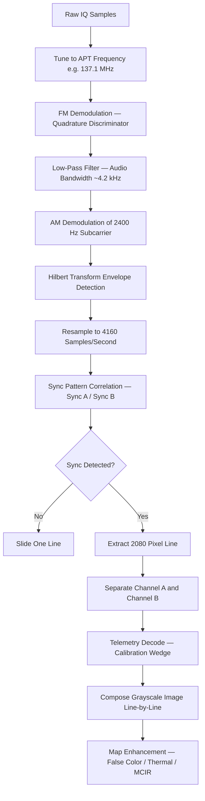
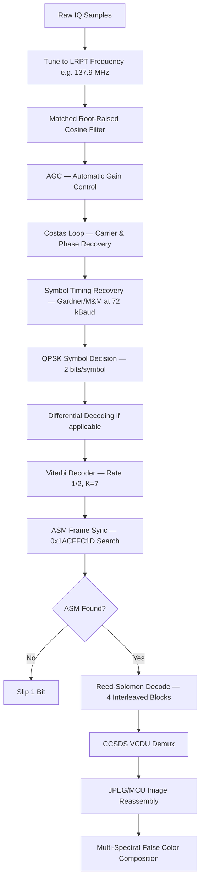

# Signal Specification: NOAA APT & Meteor-M LRPT — Weather Satellite Imagery

NOAA APT (Automatic Picture Transmission) and Meteor-M LRPT (Low Rate Picture Transmission) are polar-orbiting weather satellite downlink signals in the 137 MHz band. APT is an analog slow-scan format dating from the 1960s that transmits two-channel visible/infrared imagery. LRPT is its digital successor, transmitting higher-resolution multi-spectral imagery via QPSK modulation. Both are received during overhead passes lasting 8–15 minutes.

---

## 1. Physical Layer Parameters

### NOAA APT (Analog)

* **Active Satellites & Frequencies**:
  | Satellite | Frequency | NORAD ID | Status |
  |-----------|-----------|----------|--------|
  | NOAA 15 | 137.6200 MHz | 25338 | Active (degraded) |
  | NOAA 18 | 137.9125 MHz | 28654 | Active |
  | NOAA 19 | 137.1000 MHz | 33591 | Active |

* **Carrier Modulation**: Wideband FM (WBFM), ±17 kHz peak deviation.
* **Subcarrier**: **2400 Hz** amplitude-modulated tone carrying the image data.
* **Image Modulation**: The 2400 Hz subcarrier is **amplitude-modulated** by the video signal (0–100% depth).
* **Video Bandwidth**: ~1040 Hz (determined by 4160 pixels/line × 0.5 Hz/pixel).
* **Occupied Bandwidth**: ~34 kHz (99% OBW, dominated by FM deviation of ±17 kHz).
* **Line Rate**: 2 lines per second (one per channel: visible + infrared).
* **EIRP**: ~5 W (37 dBm).
* **Polarization**: Right-Hand Circular (RHCP).

### Meteor-M LRPT (Digital)

* **Active Satellites & Frequencies**:
  | Satellite | Frequency | Status |
  |-----------|-----------|--------|
  | Meteor-M2-3 | 137.9000 MHz | Active |
  | Meteor-M2-4 | 137.1000 MHz | Active |

* **Modulation**: QPSK (Quadrature Phase Shift Keying).
* **Symbol Rate**: 72 kBaud (72,000 symbols/s) — some configurations use 80 kBaud.
* **Bit Rate**: 144 kbps (2 bits/symbol at 72 kBaud).
* **Occupied Bandwidth**: ~100–140 kHz.
* **FEC**: Convolutional coding (rate 1/2, K=7) + Viterbi decoding, Reed-Solomon outer code.
* **Frame Structure**: CADU (Channel Access Data Unit) with ASM (Attached Sync Marker).
* **Polarization**: Right-Hand Circular (RHCP).

---

## 2. Synchronization & Frame Geometry

### APT Line Format

APT transmits a continuous image line-by-line. Each line takes **0.5 seconds** (2 lines/sec):

```
| Sync A (39 px) | Space A (47 px) | Image A (909 px) | Telemetry A (45 px) |
| Sync B (39 px) | Space B (47 px) | Image B (909 px) | Telemetry B (45 px) |
```
**Total: 2080 pixels per line = 4160 pixels per second.**

* **Sync A**: 7 cycles of 1040 Hz square wave (39 pixels at 4160 px/s). Marks the visible-channel frame.
* **Sync B**: 7 cycles of a different sync pattern (pulse train). Marks the infrared-channel frame.
* **Image A / B**: 909 pixels of 8-bit grayscale imagery per channel.
* **Telemetry A / B**: 45 pixels encoding 16 calibration wedge levels + spacecraft telemetry.
* **Space markers**: Black/white reference bars for automatic contrast adjustment.

### APT Timing
* **Pixel rate**: 4160 pixels/second.
* **Pixel duration**: $\frac{1}{4160} \approx 240.4\ \mu\text{s}$ per pixel.
* **Line duration**: $\frac{2080}{4160} = 0.5\ \text{s}$ per line (both channels).
* **Full frame**: A complete image builds up line-by-line over the entire pass (8–15 minutes).

### LRPT Frame Format (CCSDS)

LRPT uses CCSDS (Consultative Committee for Space Data Systems) framing:
```
| ASM (32 bits) | VCDU Header (48 bits) | Data Zone (8160 bits) | Reed-Solomon Check (1024 bits) |
```
* **ASM (Attached Sync Marker)**: `0x1ACFFC1D` (32 bits) — used for frame synchronization.
* **VCDU**: Virtual Channel Data Unit — contains multiplexed image data from multiple spectral channels.
* **Interleaving depth**: 4 (for Reed-Solomon block interleaving).
* **Total CADU length**: 1024 bytes.

---

## 3. Demodulation & Decoding Pipeline

### APT Demodulation



#### 1. FM Demodulation
The APT signal is FM-modulated. Apply a quadrature demodulator:
$$f_{inst}[n] = \frac{f_s}{2\pi} \cdot \text{arg}\left(s[n] \cdot s^*[n-1]\right)$$

This yields an audio-rate signal containing the 2400 Hz subcarrier.

#### 2. Subcarrier AM Demodulation
The 2400 Hz tone is amplitude-modulated by the image data. Extract the envelope:
$$e[n] = |a_{2400}[n]|$$

Where $a_{2400}[n]$ is the analytic signal obtained via Hilbert transform of the bandpass-filtered 2400 Hz component. The envelope directly represents 8-bit pixel intensity.

#### 3. Line Synchronization
Correlate the demodulated signal with the Sync A pattern (1040 Hz square wave, 39 pixels ≈ 9.375 ms). Peak correlation marks the start of each visible-channel line. Sync B (different pattern) marks infrared lines.

#### 4. Image Assembly
Sample the envelope at exactly **4160 samples/second**, extract 2080 pixels per line, split into channels A and B, and stack lines vertically to build the full-pass image.

### LRPT Demodulation



#### 1. Matched Filtering
Apply a root-raised cosine (RRC) filter matched to the QPSK pulse shape. Typical rolloff factor α = 0.35.

#### 2. Carrier & Phase Recovery
QPSK requires coherent demodulation. Use a **Costas Loop** (4th-power type for QPSK) to track carrier frequency offset and phase:
$$e_{phase} = \text{Im}(s^4[n])$$

#### 3. Symbol Timing Recovery
Lock to the **72 kBaud** symbol clock using Gardner or Mueller-Müller TED. At 288 kSPS, this is 4 samples/symbol.

#### 4. Forward Error Correction
- **Inner code**: Convolutional (rate 1/2, constraint length 7, polynomials G1=171₈, G2=133₈). Decode with Viterbi algorithm.
- **Outer code**: Reed-Solomon (255, 223) with 4-way interleaving. Corrects up to 16 byte errors per block.

#### 5. Image Reassembly
LRPT carries 3 spectral channels (visible, near-IR, thermal IR) as JPEG-compressed MCU (Minimum Coded Unit) blocks. Decompress and compose into multi-spectral imagery.

---

## 4. Orbital Considerations

* **Orbit Type**: Sun-synchronous polar orbit, altitude ~830 km (NOAA) / ~830 km (Meteor-M).
* **Orbital Period**: ~101 minutes.
* **Pass Duration**: **8–15 minutes** for a high-elevation pass.
* **Max Elevation Dependency**: Higher maximum elevation → longer pass → more image data.
* **Doppler Shift**: Up to ±3.5 kHz at 137 MHz due to orbital velocity (~7.5 km/s):
$$\Delta f_{max} = f_0 \cdot \frac{v_{sat}}{c} = 137 \times 10^6 \cdot \frac{7500}{3 \times 10^8} \approx \pm 3.4\ \text{kHz}$$
* **Pass Prediction**: Use TLE (Two-Line Element) data with SGP4 propagator. Tools: `gpredict`, `pyorbital`, Heavens-Above.

---

## 5. Companion Tools

| Tool | Description |
|------|-------------|
| **noaa-apt** | Rust-based NOAA APT decoder from WAV recordings |
| **satdump** | Universal satellite decoder — supports APT, LRPT, HRPT, and many more |
| **WXtoImg** | Legacy APT decoder with false-color overlays and map projections (no longer maintained) |
| **Meteor Demod** | Meteor-M LRPT soft-symbol demodulator |
| **meteor_decoder** | LRPT CCSDS frame decoder and image compositor |
| **gpredict** | Real-time satellite tracking and pass prediction |
| **SatNOGS** | Open-source ground station network with automated satellite recording |

---

## 6. Standards & References

* **NOAA KLM User's Guide**: Official documentation for NOAA-15, -18, -19 instrument data and APT format.
* **CCSDS 131.0-B-3**: TM Synchronization and Channel Coding (defines convolutional + RS coding used in LRPT).
* **CCSDS 132.0-B-2**: TM Space Data Link Protocol (VCDU framing).
* **ITU-R SA.1027**: Sharing criteria for space-to-Earth links in the 137 MHz band.
* **WMO No. 1023**: Guide to the WMO Integrated Global Observing System (satellite data distribution).
