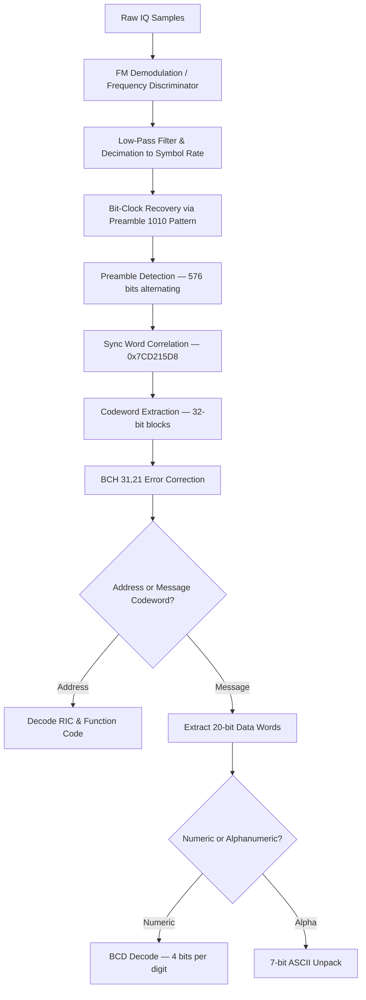

# Signal Specification: Pager Systems (POCSAG & FLEX)

POCSAG (Post Office Code Standardisation Advisory Group) and FLEX are one-way paging protocols used to deliver short numeric, alphanumeric, and tone-only messages to pager receivers. POCSAG (ITU-R Rec. M.584) is the dominant legacy standard worldwide. Motorola's FLEX protocol succeeded POCSAG with higher throughput and 4-level FSK.

---

## 1. Physical Layer Parameters

### POCSAG

* **Frequency Bands**:
  - US: 152.0075 MHz, 157.9000 MHz, 462.750 MHz
  - EU: 466 MHz band (various allocations)
  - Commercial paging: 148–174 MHz, 450–470 MHz
* **Modulation**: 2-FSK (Binary FSK)
  - Logic 1 (mark): +4.5 kHz deviation
  - Logic 0 (space): −4.5 kHz deviation
* **Baud Rates**: 512, 1200, or 2400 baud
* **Channel Bandwidth**: 25 kHz (legacy), 12.5 kHz (narrowband)
* **Encoding**: NRZ (Non-Return-to-Zero)
* **Error Correction**: BCH(31,21) — each 32-bit codeword contains 21 data bits, 10 parity bits, and 1 even-parity bit

### FLEX

* **Frequency Bands**:
  - US: 929–932 MHz (primary high-speed paging)
  - Various: 138–174 MHz, 406–512 MHz
* **Modulation**: 2-FSK or 4-FSK
  - 2-FSK: ±4.8 kHz deviation (1600 baud, 3200 baud)
  - 4-FSK: ±4.8 kHz and ±1.6 kHz deviation (6400 baud)
* **Baud Rates**: 1600, 3200, or 6400 baud
* **Channel Bandwidth**: 25 kHz
* **Encoding**: NRZ with interleaving
* **Error Correction**: BCH(32,21) + 4-level interleaved block coding

---

## 2. Synchronization & Frame Geometry

### POCSAG Frame Format

```
| Preamble (576 bits) | Sync Codeword (32 bits) | Batch 1 (16 codewords) | Sync | Batch 2 | ... | Sync | Batch N |
```

#### Preamble
- Exactly **576 bits** of alternating `1010...10` pattern.
- Duration at 512 baud: $576 / 512 = 1.125\\ \text{s}$
- Duration at 1200 baud: $576 / 1200 = 480\\ \text{ms}$
- Duration at 2400 baud: $576 / 2400 = 240\\ \text{ms}$
- Provides reliable bit-clock synchronization for the receiver.

#### Sync Codeword
- Fixed 32-bit pattern: `0x7CD215D8`
- Binary: `0111 1100 1101 0010 0001 0101 1101 1000`
- Marks the start of every batch.

#### Batch Structure
- Each batch contains exactly **8 frames** of **2 codewords** each = **16 codewords** per batch.
- Each codeword is **32 bits**:
  - Bit 0 (MSB): Function bit — `0` = Address codeword, `1` = Message codeword
  - Bits 1–20: Data (address or message content)
  - Bits 21–30: BCH(31,21) parity bits
  - Bit 31: Even parity over bits 0–30

#### Address Codeword
```
| 0 (1 bit) | Address bits (18 bits) | Function code (2 bits) | BCH parity (10 bits) | Parity (1 bit) |
```
- Full address = (address bits × 8) + frame position (0–7)

#### Message Codeword
```
| 1 (1 bit) | Message data (20 bits) | BCH parity (10 bits) | Parity (1 bit) |
```

#### Idle Codeword
- Fixed pattern: `0x7A89C197`
- Fills empty frame slots to maintain synchronization.

### FLEX Frame Format

```
| Sync 1 (1600 baud, 2-FSK) | Frame Info Word | Sync 2 | Block Info Word | Data Blocks (11) | Idle |
```

- FLEX frames are exactly **1.875 seconds** long (1 cycle = 128 frames = 4 minutes).
- Sync 1 is always transmitted at **1600 baud / 2-FSK** regardless of frame speed.
- Frame Info Word encodes the speed (1600/3200/6400) used for the remainder of the frame.

### Message Types

| Type | POCSAG Encoding | Description |
|---|---|---|
| **Tone-only** | Address codeword, function bits = 00 | Alert only, no data payload |
| **Numeric** | BCD encoding, 4 bits/digit | Digits 0–9 plus `*`, `U`, ` `, `-`, `]`, `(` |
| **Alphanumeric** | 7-bit ASCII, packed MSB-first into 20-bit codewords | Standard ASCII character set |

---

## 3. Demodulation & Decoding Pipeline



### FM Discrimination
1. **Frequency Discriminator**: Compute the instantaneous frequency of the IQ signal:
   $$f_{inst}[n] = \frac{1}{2\pi} \cdot \angle \left( r[n] \cdot r^*[n-1] \right)$$
   This converts the FSK-modulated signal into a bipolar baseband waveform where positive values represent logic 1 and negative values represent logic 0.

2. **Bit Slicing**: After low-pass filtering, apply a zero-crossing threshold to extract the binary bit stream. The alternating preamble provides a natural reference level for adaptive thresholding.

3. **Sync Word Correlation**: Correlate the bit stream against the known sync word `0x7CD215D8`. A match within a Hamming distance ≤ 2 bits is a reliable detection.

---

## 4. Companion Tools

| Tool | Platform | Notes |
|---|---|---|
| **multimon-ng** | Linux/macOS | Primary open-source decoder; supports POCSAG 512/1200/2400 |
| **PDW** | Windows | Paging decoder with GUI, supports POCSAG + FLEX |
| **rt_airband** | Linux | RTL-SDR based scanner with pager decode support |
| **Unitrunker** | Windows | Trunking + paging decoder for FLEX |
| **GNU Radio** | Cross-platform | Custom flowgraph-based POCSAG demodulation |
