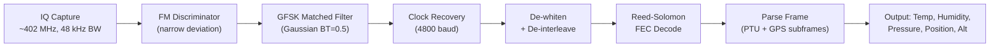

# Signal Specification: Radiosondes — Weather Balloon Telemetry 🎈🌡️

Radiosondes are instrument packages launched on weather balloons by meteorological agencies worldwide. They transmit temperature, humidity, pressure, and GPS position as they ascend through the atmosphere. **~1,800 launches daily** from ~900 stations worldwide (00Z and 12Z UTC).

One of the most popular SDR reception targets — predictable, strong signal, and free real-time atmospheric data.

---

## 1. Physical Layer Parameters

### Vaisala RS41 (Most Common Worldwide)
* **Frequency**: 400.0–406.0 MHz (assigned per station, typically 401–403 MHz in US)
* **Modulation**: GFSK, ±2.4 kHz deviation
* **Data Rate**: 4800 baud
* **Bandwidth**: ~12 kHz occupied
* **TX Power**: 60 mW (+18 dBm)
* **Frame Rate**: 1 frame/second
* **Frame Length**: 320 bytes (variable subframes)
* **Encoding**: Reed-Solomon FEC, interleaved, whitened

### Vaisala RS92 (Legacy, Being Phased Out)
* **Frequency**: 400–406 MHz
* **Modulation**: GFSK, 4800 baud
* **GPS**: L1 raw measurements (needs almanac to decode position)
* **Note**: RS92 does NOT transmit decoded GPS — it sends raw GPS observables

### Graw DFM-09 / DFM-17
* **Frequency**: 400–406 MHz
* **Modulation**: FSK, 2500 baud
* **Bandwidth**: ~6 kHz
* **Frame**: Manchester encoded, no FEC
* **GPS**: Transmits decoded lat/lon/alt

### Meisei iMS-100 / RS-11G (Japan)
* **Frequency**: 400–406 MHz
* **Modulation**: GFSK, 4800 baud
* **Frame**: XDATA-compatible subframes

### US Legacy (1680 MHz)
* **Frequency**: 1676–1683 MHz
* **Modulation**: FSK, 1200 baud
* **Status**: Being phased out in favor of 400 MHz GPS sondes
* **Note**: Requires L-band capable SDR (RTL-SDR can't receive this)

---

## 2. Telemetry Data

| Parameter | Source | Resolution |
|---|---|---|
| **Temperature** | Thermistor (RS41: heated twin-sensor) | 0.01°C |
| **Humidity** | Capacitive sensor (RS41: heated H-chip) | 0.1% RH |
| **Pressure** | Derived from GPS altitude + atmosphere model (RS41) or direct sensor (RS92) | 0.1 hPa |
| **GPS Position** | GPS receiver (RS41: u-blox) | ~5 m horizontal |
| **GPS Altitude** | GPS receiver | ~10 m |
| **Ascent Rate** | Derived from GPS altitude vs time | ~0.1 m/s |
| **Wind Speed/Direction** | Derived from GPS horizontal drift | ~1 m/s |

---

## 3. Flight Profile

```
Altitude (m)
35,000 ─ ─ ─ ─ ─ ─ ─ ★ Burst (~30-35 km)
       │                │
       │   Ascent        │ Descent (parachute)
       │   ~5 m/s        │ ~5-15 m/s
       │                │
 0 ────┼────────────────┼──── Time
    Launch           ~90 min         ~120 min
    (surface)                      (landing)
```

* **Ascent**: ~90 minutes, ~5 m/s ascent rate
* **Burst altitude**: 25–35 km (balloon pops)
* **Descent**: Parachute, ~30 minutes
* **Drift**: 50–200 km horizontal from launch site
* **Signal duration**: 90–120 minutes receivable per flight

---

## 4. Demodulation Pipeline



---

## 5. Tools

| Tool | Capability |
|---|---|
| **radiosonde_auto_rx** | Auto-detect and decode RS41, RS92, DFM, M10, iMS-100, LMS6. Uploads to SondeHub. The gold standard. |
| **SondeHub** | Real-time global radiosonde tracking map (sondehub.org) |
| **dxlAPRS** | Radiosonde decoder + APRS gateway |
| **RS41 Tracker** | Firmware for recovered RS41 — repurpose as amateur tracker |
| **auto_rx_ng** | Next-gen radiosonde_auto_rx |

```bash
# radiosonde_auto_rx — fully automated decode + upload
# https://github.com/projecthorus/radiosonde_auto_rx
cd radiosonde_auto_rx/auto_rx/
python3 auto_rx.py

# Manual decode with rtl_fm
rtl_fm -f 402500000 -M fm -s 48000 -g 40 | sox -t raw -r 48000 -e s -b 16 -c 1 - -r 48000 -t wav - | rs41mod --ptu --ecc2
```

---

## 6. How to Find Radiosondes

1. **Check SondeHub** (sondehub.org) for recent flights near your location
2. **Launch times**: 00Z (UTC) and 12Z (UTC) from NWS stations — typically 11:15Z and 23:15Z (launched 45 min early to reach altitude by synoptic time)
3. **Scan 400–406 MHz** around launch time — strong GFSK signal, easy to spot
4. **Chase & recover**: Track descent on SondeHub, drive to predicted landing site. Sondes are **legal to keep** (NWS considers them disposable).
