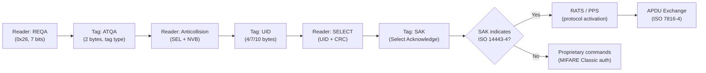

# Signal Specification: HF RFID & NFC (13.56 MHz) 📱💳

High-Frequency RFID and Near-Field Communication — contactless payment cards, transit cards, building access, phone-to-phone data exchange, NFC tags.

---

## 1. Physical Layer Parameters

* **Frequency**: 13.56 MHz (ISM band, worldwide)
* **Coupling**: Inductive (magnetic near-field)
* **Read Range**: 0–10 cm (NFC), up to 1 m (ISO 15693 vicinity cards)
* **Modulation (reader → tag)**:
  - **ASK** (100% or 10% modulation depth)
  - **Modified Miller** encoding (ISO 14443 Type A)
  - **NRZ-L** encoding (ISO 14443 Type B)
  - **1-out-of-4 PPM** (ISO 15693)
* **Modulation (tag → reader)**:
  - **Load modulation** with subcarrier at 847.5 kHz (ISO 14443A/B) or 423.75 kHz (ISO 15693)
  - **Manchester** or **BPSK** subcarrier encoding
* **Data Rates**: 106, 212, 424, 848 kbps
* **Channel Bandwidth**: ~1.5 MHz (at 106 kbps)

---

## 2. Protocol Standards

| Standard | Alt Name | Data Rate | Range | Use Case |
|---|---|---|---|---|
| **ISO 14443A** | NFC-A | 106–848 kbps | < 10 cm | MIFARE, bank cards, passports |
| **ISO 14443B** | NFC-B | 106–848 kbps | < 10 cm | Some government IDs, Calypso transit |
| **ISO 15693** | NFC-V | 1.66–26.48 kbps | < 1 m | Library books, industrial, longer range |
| **ISO 18092** | NFC-F (FeliCa) | 212/424 kbps | < 10 cm | Sony FeliCa, Japan transit (Suica/PASMO) |
| **ISO 18000-3** | — | Various | < 1 m | Item-level tagging |

---

## 3. Common Tag/Card Types

### MIFARE Family (NXP — by far the most common)
| Type | Memory | Security | Use |
|---|---|---|---|
| **MIFARE Classic 1K/4K** | 1/4 KB | Crypto-1 (**broken** — Darkside/Hardnested attacks) | Legacy transit, access control |
| **MIFARE Ultralight** | 64 bytes | None (or password) | Single-use transit tickets, NFC tags |
| **MIFARE DESFire EV1/EV2/EV3** | 2/4/8 KB | AES-128, 3DES | Modern transit, secure access |
| **NTAG213/215/216** | 144/504/888 bytes | None (or password) | NFC tags, Amiibo (NTAG215), smart posters |

### EMV Contactless (Payment Cards)
* **Visa payWave, Mastercard PayPass, Amex ExpressPay**
* ISO 14443A at 13.56 MHz
* Secure element with RSA/ECC cryptography
* Application Selection via PPSE (Proximity Payment System Environment)
* Transaction data encrypted; **replay attacks mitigated** by dynamic cryptograms

### Government / ID Documents
* **e-Passports (ICAO 9303)**: ISO 14443A/B, BAC/PACE authentication, active/passive authentication
* **National ID cards**: Various implementations
* **REAL ID / Driver's licenses**: Some US states using HF RFID

---

## 4. NFC Modes (ISO 18092 / NFC Forum)

| Mode | Description | Use Case |
|---|---|---|
| **Reader/Writer** | Phone reads passive tag | Reading NFC stickers, smart posters, Amiibo |
| **Peer-to-Peer** | Two active NFC devices exchange data | Android Beam (deprecated), data exchange |
| **Card Emulation** | Phone acts as contactless card | Google Pay, Apple Pay, transit passes |

---

## 5. Anti-Collision & Communication Sequence

### ISO 14443A (MIFARE, EMV, NTAG)


---

## 6. Tools

| Tool | Capability |
|---|---|
| **Proxmark3** | Full protocol analysis, sniff, emulate, crack MIFARE Classic |
| **Flipper Zero** | Read/emulate NFC-A (MIFARE Classic/Ultralight/NTAG) |
| **ACR122U** | USB NFC reader for libnfc/mfoc/mfcuk |
| **libnfc** | Open-source NFC library |
| **mfoc / mfcuk** | MIFARE Classic key recovery (Darkside / Hardnested) |
| **ChameleonMini / ChameleonUltra** | Full NFC emulator/sniffer |
| **NFCGate** | Android NFC relay attack tool |
| **Smartphone NFC** | Read NDEF tags, NFC TagInfo app |

```bash
# Proxmark3 commands
pm3 --> hf search            # Auto-detect HF tag type
pm3 --> hf 14a reader        # Read ISO 14443A tag (UID, ATQA, SAK)
pm3 --> hf mf autopwn        # Auto-attack MIFARE Classic (key recovery)
pm3 --> hf mfu dump          # Dump MIFARE Ultralight
pm3 --> hf 14a sniff         # Sniff reader-tag communication
```

> ⚠️ **Note**: Like LF RFID, HF RFID/NFC operates via magnetic near-field coupling at 13.56 MHz. While 13.56 MHz is within HackRF's range (1–6000 MHz), receiving NFC requires a specialized coil antenna and the signal is near-field only — you must be within centimeters of the card/reader.

---

## 7. Security Research Notes

* **MIFARE Classic is broken**: Crypto-1 cipher fully reverse-engineered. Keys recoverable in seconds with Darkside, Hardnested, or Static Nonce attacks.
* **EMV contactless is secure against replay**: Dynamic Data Authentication (DDA) uses per-transaction cryptograms.
* **UID-only systems are insecure**: Any system that authenticates based solely on UID (without challenge-response) is trivially cloneable.
* **Relay attacks**: NFC communication can be relayed over the internet using NFCGate (Android), extending the effective range from 10 cm to unlimited.
