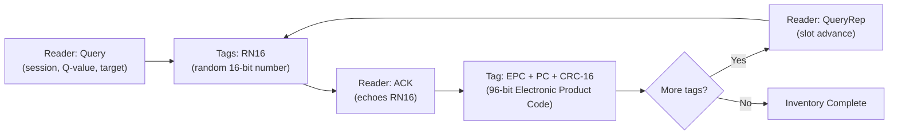

# Signal Specification: UHF RFID — EPC Gen2 (860–960 MHz) 🏷️📦

Ultra-High-Frequency RFID — supply chain, inventory management, toll collection, race timing, anti-theft tags. The only RFID band **receivable by standard SDR hardware**.

---

## 1. Physical Layer Parameters

* **Frequency Bands**:
  - **902–928 MHz** (US, FCC Part 15) — most common
  - **865–868 MHz** (EU, ETSI EN 302 208)
  - **860–960 MHz** (global range, region-specific subbands)
* **Coupling**: Radiative (far-field electromagnetic) — NOT near-field like LF/HF RFID
* **Read Range**: 1–12 meters (passive tags), up to 100 m (battery-assisted passive)
* **Reader → Tag (Downlink)**:
  - **DSB-ASK, SSB-ASK, or PR-ASK** modulation
  - **PIE (Pulse Interval Encoding)**: Data-0 = short, Data-1 = long interval
  - **Tari**: 6.25–25 µs (symbol period, reader-configurable)
* **Tag → Reader (Uplink / Backscatter)**:
  - **FM0 (Bi-Phase Space)** or **Miller** encoding
  - **Backscatter Link Frequency (BLF)**: 40–640 kHz
  - Data rates: 40–640 kbps
* **Occupied Bandwidth**: 200–500 kHz per channel

---

## 2. Protocol: EPC Class 1 Gen 2 (ISO 18000-63)

### Inventory Round (Tag Singulation)


### EPC (Electronic Product Code) Structure — 96 bits
```
| Header (8 bits) | Filter (3 bits) | Partition (3 bits) | Company Prefix (20-40 bits) | Item Reference (24-44 bits) | Serial (36 bits) |
```

### Key Commands
| Command | Bits | Purpose |
|---|---|---|
| **Query** | 22 | Start inventory round, set Q-value (anti-collision slots) |
| **QueryRep** | 4 | Advance to next slot |
| **ACK** | 18 | Acknowledge tag, request full EPC |
| **Read** | 58+ | Read tag memory banks (TID, User, Reserved) |
| **Write** | 66+ | Write to tag memory |
| **Kill** | 66+ | Permanently disable tag (requires 32-bit kill password) |
| **Lock** | 60+ | Lock memory banks |
| **Select** | variable | Pre-filter tags by EPC, TID, or memory content |

---

## 3. Memory Banks

| Bank | Address | Contents |
|---|---|---|
| **Reserved (0)** | — | Kill password (32 bits), Access password (32 bits) |
| **EPC (1)** | — | CRC-16, Protocol Control (PC), EPC (96+ bits) |
| **TID (2)** | — | Tag IC manufacturer + model ID (unique, read-only) |
| **User (3)** | — | Optional user data memory (0–512 bits, tag-dependent) |

---

## 4. Burst & Timing Characteristics

* **Reader duty cycle**: Can be up to 100% during inventory (continuous CW for tag backscatter)
* **Tag response**: Extremely fast — backscatter within µs of reader command
* **Inventory speed**: 200–1000 tags/second
* **Channel hopping**: FHSS across 50 channels in 902–928 MHz (FCC requirement)

---

## 5. Common Use Cases

| Application | Read Range | Tag Type |
|---|---|---|
| Supply chain / pallets | 5–10 m | Passive inlay (Impinj Monza, NXP UCODE) |
| Retail anti-theft (EAS) | 1–2 m | Passive hard tag |
| Toll collection (E-ZPass) | 5–10 m | Battery-assisted passive (BAP) |
| Race timing | 1–5 m | Passive bib tag |
| Library books | 0.5–1 m | Passive label |
| Animal tracking | 1–3 m | Passive ear tag |

---

## 6. Tools

| Tool | Capability |
|---|---|
| **SDR (HackRF/USRP)** | Can receive reader downlink and tag backscatter; GNU Radio gr-rfid |
| **Impinj Speedway** | Commercial RAIN RFID reader |
| **ThingMagic** | Embedded RFID reader module |
| **GNU Radio gr-rfid** | Open-source EPC Gen2 reader/decoder for USRP |
| **Wireshark** | Dissects EPC Gen2 protocol from pcap |

```bash
# GNU Radio EPC Gen2 (requires USRP B200/B210 or similar)
# https://github.com/nkargas/Gen2-UHF-RFID-Reader
cd Gen2-UHF-RFID-Reader/
gnuradio-companion reader.grc

# HackRF can receive reader commands (downlink) at 902-928 MHz
hackrf_transfer -r capture.cs8 -f 915000000 -s 2000000 -g 40
```

> 📡 **SDR Note**: UHF RFID at 902–928 MHz IS receivable by RTL-SDR and HackRF. However, decoding the backscatter (tag response) requires high SNR and precise timing — a USRP B200 with GNU Radio gr-rfid is recommended for full decode. RTL-SDR can detect reader activity but typically can't decode tag responses.
