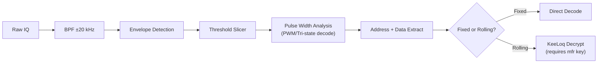

# Signal Specification: Car Key Fobs & Garage Remotes (rtl_433) 🔑

Automotive remote keyless entry (RKE), garage door openers, and gate remotes. Event-triggered, not periodic.

---

## 1. Physical Layer Parameters

* **Frequency Bands**: 315 MHz (North America), 433.92 MHz (EU/Asia/global), 868 MHz (EU)
* **Modulation**: OOK/ASK (dominant), some FSK
* **Symbol Rates**: 1–5 kBaud (PWM or Manchester encoded)
* **Encoding**: PWM (PT2262/EV1527), Manchester, tri-state
* **Occupied Bandwidth**: 10–30 kHz

---

## 2. Encoding & Security

### Fixed Code (older systems)
* **Chips**: Princeton PT2262/PT2264, Holtek HT12E, EV1527
* **Address space**: 20–28 bit device ID set by DIP switches or OTP
* **Security**: Trivially replayable — same code every press

### Rolling Code (modern vehicles)
* **Chips**: Microchip KeeLoq, NiceFloR-S, Came TOP
* **Mechanism**: 66-bit encrypted counter increments each press; receiver rejects old codes
* **Security**: Resistant to simple replay; vulnerable to RollJam/RollBack in some implementations

> ⚠️ **Research & Education Only**: Signal analysis of RKE systems is for research purposes. Unauthorized access to vehicles or property is illegal.

---

## 3. Frame Geometry

### Fixed Code (PT2262)
```
| Sync Pulse (long LOW) | Address (12 tri-state bits = 24 pulse widths) | Data (4 bits) | Repeat ×3-8 |
```

### Rolling Code (KeeLoq)
```
| Preamble (15 short pulses) | Header | Serial (28 bits) | Button (4 bits) | Encrypted Counter (32 bits) | Repeat ×3 |
```

---

## 4. Burst Characteristics

* **Burst Duration**: 5–30 ms per packet
* **Repetitions**: 3–8 packets on button press
* **Periodic Reporting**: **None** — event-triggered only
* **Duty Cycle**: Effectively 0% (only active during button press)

---

## 5. Demodulation Pipeline



---

## 6. Companion Tools

```bash
# Auto-detect remotes on 433 MHz
rtl_433 -f 433920000 -s 250000

# US 315 MHz key fobs
rtl_433 -f 315000000 -s 250000

# Universal Radio Hacker (URH) for custom analysis
urh
```
