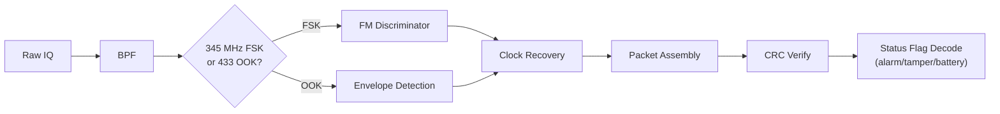

# Signal Specification: Home Security Sensors (rtl_433) 🏠🔒

Door/window contact sensors, PIR motion detectors, smoke/CO alarms, glass break sensors, water leak detectors, and panic buttons.

---

## 1. Physical Layer Parameters

* **Frequency Bands**: 315 MHz (US), **345 MHz** (Honeywell/2GIG — unique band), 433.92 MHz (EU/Asia)
* **Modulation**: OOK/ASK (most), FSK (Honeywell 5800 series)
* **Symbol Rates**: 1–8 kBaud
* **Encoding**: PWM (most OOK sensors), Manchester (some), NRZ (Honeywell FSK)
* **Occupied Bandwidth**: 10–50 kHz

---

## 2. Device Types

| Category | Example Models | Frequency |
|---|---|---|
| Door/Window Contact | Honeywell 5811, 2GIG DW10, Visonic MCT-340 | 345 / 433 MHz |
| PIR Motion Detector | Honeywell 5890PI, DSC WS4904P | 345 / 433 MHz |
| Smoke/CO Detector | Honeywell 5808W3, First Alert/BRK | 345 / 433 MHz |
| Glass Break Sensor | Honeywell 5853 | 345 MHz |
| Water Leak / Flood | Various | 433 MHz |
| Panic Button | Honeywell 5802MN | 345 MHz |

---

## 3. Frame Geometry

### Honeywell 5800 Series (345 MHz, FSK, 8 kBaud)
```
| Preamble (8 bytes 0xFF) | Sync (0x2DD4) | Device ID (20 bits) | Loop/Zone (4 bits) | Status Flags (8 bits) | CRC-8 |
```

### Generic OOK Sensors (433 MHz)
```
| Preamble (sync pulses) | ID (20-24 bits) | Zone (4 bits) | Flags (tamper|battery|alarm|supervise) | CRC |
```

### Status Flag Fields
| Flag | Meaning |
|---|---|
| Alarm | Zone is tripped (door open, motion detected, smoke detected) |
| Tamper | Sensor cover removed or wire cut |
| Low Battery | Battery needs replacement |
| Supervisory | Periodic heartbeat to confirm sensor is alive |

---

## 4. Transmission Modes

* **Event-triggered**: Immediate transmission on alarm (door open, motion, smoke), repeated 3–5 times
* **Supervisory heartbeat**: Every 60–90 minutes to confirm sensor is alive and connected
* **Tamper immediate**: Instant transmission on case opening
* **Duty Cycle**: < 0.1% (sparse)

---

## 5. Demodulation Pipeline



---

## 6. Companion Tool

```bash
# Honeywell 5800 series at 345 MHz
rtl_433 -f 345000000 -s 250000

# EU security sensors at 433 MHz
rtl_433 -f 433920000 -s 250000

# JSON output for Home Assistant integration
rtl_433 -f 345000000 -F json -M utc
```
