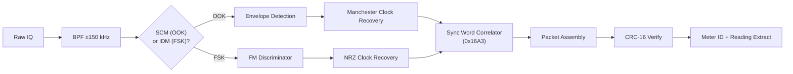

# Signal Specification: AMR Utility Meters (rtl_433) ⚡💧🔥

Automatic Meter Reading (AMR) smart meters for electricity, gas, and water. Higher baud rates and more frequent transmissions than other Sub-GHz ISM devices.

---

## 1. Physical Layer Parameters

* **Frequency Bands**: **902–928 MHz** (US ISM, primary), 868 MHz (EU)
* **Modulation**: OOK/ASK (SCM, SCM+), FSK (IDM, NetIDM, R900)
* **Symbol Rates**: 16–32 kBaud (significantly higher than weather stations)
* **Encoding**: Manchester (SCM), NRZ (IDM), differential Manchester (some)
* **Occupied Bandwidth**: 50–200 kHz

---

## 2. Protocol Variants

| Protocol | Modulation | Baud Rate | Packet Size | Used By |
|---|---|---|---|---|
| **SCM** (Standard Consumption Message) | OOK Manchester | ~32 kBaud | 96 bits (12 bytes) | Most US electric/gas/water meters |
| **SCM+** | OOK Manchester | ~32 kBaud | 128 bits (16 bytes) | Extended SCM with additional fields |
| **IDM** (Interval Data Message) | FSK | ~32 kBaud | 92 bytes | Itron/Centron meters (47 interval readings) |
| **NetIDM** | FSK | ~32 kBaud | ~100 bytes | Network-addressed IDM variant |
| **R900** | FSK | ~16 kBaud | ~24 bytes | Neptune water meters |

---

## 3. Frame Geometry

### SCM Packet (96 bits)
```
| Preamble (21 bits sync train) | Sync (0x16A3) | ERT ID (26 bits) | Type (4 bits) | Tamper (6 bits) | Consumption (24 bits) | CRC-16 |
```

### IDM Packet (92 bytes)
```
| Preamble (32 bytes 0xAA) | Sync (0x16A3 1A) | Packet Type (1) | Meter ID (4) | Meter Type (1) | ... | 47 Interval Readings (47) | CRC-16 (2) |
```

### Payload Fields
| Field | Description |
|---|---|
| ERT/Meter ID | 26–32 bit unique meter identifier |
| Meter Type | 4–8 bits: Electric (4/5/7), Gas (2/12), Water (3/11) |
| Consumption | 24–48 bit cumulative reading (kWh, gallons, CCF) |
| Tamper Flags | Physical/magnetic tamper indicators |
| Interval Data | 47 historical usage readings (IDM only) |

---

## 4. Burst Characteristics

* **Burst Duration**: 10–50 ms (SCM), 50–100 ms (IDM — long packets)
* **Reporting Interval**: Every 5–30 seconds (much more frequent than weather stations)
* **Duty Cycle**: 1–5% (relatively high for ISM devices)

> ⚠️ **Privacy Note**: Meter IDs and consumption data are transmitted in cleartext. For research and education purposes only.

---

## 5. Demodulation Pipeline



---

## 6. Companion Tools

```bash
# US 900 MHz band (needs higher sample rate)
rtl_433 -f 915000000 -s 1000000

# Specific SCM protocol
rtl_433 -f 915000000 -s 1000000 -R 47

# Also: rtl_amr project for dedicated AMR decoding
# https://github.com/bemasher/rtlamr
rtlamr -filterid=<meter_id>
```
