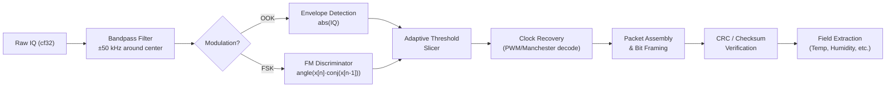

# Signal Specification: Weather Stations (rtl_433) 🌦️

The single largest category of Sub-GHz ISM devices. Covers outdoor weather stations, indoor climate sensors, rain gauges, and wind sensors from 100+ manufacturers. All decoded by `rtl_433`.

---

## 1. Physical Layer Parameters

* **Frequency Bands**: 433.92 MHz (EU/Asia, most common), 315 MHz (US — Acurite), 868 MHz (EU — Bresser, Fine Offset), 915 MHz (US — rare)
* **Modulation**:
  - **OOK/ASK** (most common): Acurite, Oregon Scientific, LaCrosse, Prologue, Nexus, Eurochron
  - **FSK/GFSK** (minority): Fine Offset WH1080/WH2032, Bresser 5/6/7-in-1
* **Symbol Rates**: 1–4 kBaud (OOK variants), 10–17 kBaud (FSK variants)
* **Encoding Schemes**:
  - **Manchester** (Oregon Scientific v2.1/v3): Each bit encoded as two half-bit transitions
  - **PWM** (Acurite, LaCrosse): Bit value determined by pulse-width ratio
  - **Direct NRZ** (some FSK sensors): No line coding — raw bit mapping
* **Occupied Bandwidth**: 10–60 kHz (OOK), 40–100 kHz (FSK)

---

## 2. Synchronization & Frame Geometry

### Preamble Patterns (by manufacturer family)
| Family | Preamble | Sync Word | Encoding |
|---|---|---|---|
| Acurite 592TXR / 606TX | 4× `0xFF` bytes (32 carrier pulses) | `0x2DD4` | PWM |
| Oregon Scientific v2.1 | 16× `0101` alternating bits | `0x5A5A` (Manchester) | Manchester |
| Oregon Scientific v3 | 24× `1010` alternating bits | `0xA` nibble | Manchester |
| LaCrosse TX141 / TX7U | 8× `1010` pulses | Variable (model-specific) | PWM |
| Fine Offset WH1080 | 8× `0xFF` preamble | `0x2DD4` | FSK NRZ |
| Bresser 5-in-1 | Long alternating preamble | `0xAA 0x2D 0xD4` | FSK NRZ |
| Prologue / Nexus | 8× short sync pulses | Implicit (first data bit) | PWM |

### Generic Packet Layout
```
| Preamble (8-32 bits) | Sync Word (8-16 bits) | Payload (40-80 bits) | CRC/Checksum (8 bits) |
```

### Payload Fields (typical)
| Field | Width | Description |
|---|---|---|
| Sensor ID | 8–24 bits | Randomized on battery change |
| Channel | 2–4 bits | 1–3 or A/B/C selector |
| Battery Low | 1 bit | Low-battery flag |
| Temperature | 12 bits | Signed, 0.1°C resolution |
| Humidity | 8 bits | 0–100% RH |
| Wind Speed | 8–12 bits | m/s or mph (5-in-1 models) |
| Wind Direction | 4–9 bits | Degrees or compass index |
| Rain Counter | 8–16 bits | Cumulative 0.1 mm tips |

---

## 3. Burst Characteristics

* **Burst Duration**: 20–80 ms per packet
* **Repetitions**: 2–5 identical packets per transmission event
* **Inter-packet Gap**: 1–2 seconds between repeats
* **Reporting Interval**: 30–60 seconds (temperature), 10–30 seconds (wind/rain)
* **Duty Cycle**: < 1%

---

## 4. Demodulation Pipeline



---

## 5. Companion Tool

```bash
# Auto-detect all weather station protocols on 433 MHz
rtl_433 -f 433920000 -s 250000

# Filter to specific protocol (e.g., Acurite 592TXR = protocol 40)
rtl_433 -f 433920000 -R 40

# Output JSON for programmatic parsing
rtl_433 -f 433920000 -F json

# EU 868 MHz band (Bresser, Fine Offset)
rtl_433 -f 868000000 -s 250000
```

---

## 6. Popular Device Families

| Manufacturer | Models | Frequency | Modulation | Encoding |
|---|---|---|---|---|
| Acurite | 592TXR, 606TX, 5n1 Atlas | 433 MHz | OOK | PWM |
| Oregon Scientific | v2.1, v3 (THN132N, THGR122NX) | 433 MHz | OOK | Manchester |
| LaCrosse | TX141, TX7U, WS-2310 | 433 MHz | OOK | PWM |
| Fine Offset | WH1080, WH2032 (Ambient Weather rebrand) | 433/868 MHz | FSK | NRZ |
| Bresser | 5-in-1, 6-in-1, 7-in-1 | 868 MHz | FSK | NRZ |
| Prologue / Nexus | Generic indoor temp/hum sensors | 433 MHz | OOK | PWM |
| Eurochron / Rubicson | Budget temp/hum sensors | 433 MHz | OOK | PWM |
