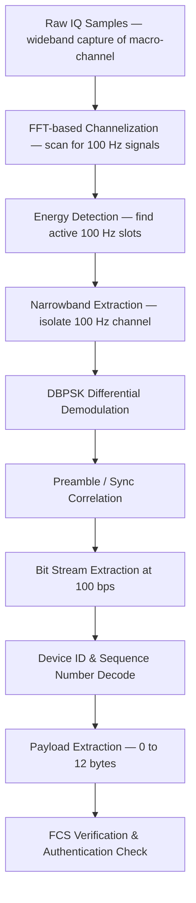

# Signal Specification: Sigfox (Ultra-Narrowband LPWAN)

Sigfox is a proprietary ultra-narrowband (UNB) low-power wide-area network (LPWAN) protocol designed for massive IoT deployments. It operates in unlicensed sub-GHz ISM bands using extremely narrow 100 Hz uplink channels — the narrowest digital signal in common commercial use. Sigfox uses a simplified protocol stack with no pairing, handshaking, or connection establishment, allowing endpoint devices to achieve multi-year battery life on a single coin cell.

---

## 1. Physical Layer Parameters

### Uplink (Device → Base Station)

* **Frequency Bands**:
  - EU (ETSI): **868.034–868.226 MHz** (192 kHz macro-channel within 868 MHz ISM)
  - US (FCC): **902.137–904.863 MHz** (≈2.7 MHz macro-channel within 902–928 MHz ISM)
  - Other regions: Various sub-GHz ISM allocations
* **Modulation**: **DBPSK** (Differential Binary Phase Shift Keying)
  - No coherent carrier recovery needed — differential detection compares successive symbol phases
  - Phase shift: 0° = bit `0`, 180° = bit `1`
* **Data Rate**: **100 bps** (EU) or **600 bps** (US, for FCC compliance with frequency hopping)
* **Symbol Rate**: 100 baud (EU), 600 baud (US)
* **Channel Bandwidth**: **100 Hz** (EU) — ultra-narrowband
  - US: 600 Hz per channel
* **Transmit Power**: 14 dBm (EU, ETSI limit), 22 dBm (US, FCC with FHSS)
* **Frequency Accuracy**: ±$\text{few Hz}$ (no crystal oscillator correction protocol — base station performs blind search)

### Downlink (Base Station → Device)

* **Frequency**: Fixed offset from uplink
  - EU: Uplink frequency + **1.533 MHz**
  - US: Uplink frequency − **3.0 MHz** (approximately)
* **Modulation**: **GFSK** (Gaussian Frequency Shift Keying)
  - BT product: 0.5
  - Deviation: ±800 Hz
* **Data Rate**: **600 bps**
* **Channel Bandwidth**: ~600 Hz

### RFTDMA (Random Frequency and Time Division Multiple Access)

Sigfox's unique access scheme requires no synchronization or channel assignment:

1. Each uplink message is transmitted **3 times** on **3 different randomly selected frequencies** within the macro-channel.
2. Timing between retransmissions is randomized (typically 0–30 seconds apart).
3. Base stations perform **blind scanning** across the entire macro-channel to detect 100 Hz transmissions.
4. Diversity combining across base stations and retransmissions provides robustness.

---

## 2. Synchronization & Frame Geometry

### Uplink Frame Format (EU, 100 bps)

```
| Preamble & Frame Sync (≈26 bits) | Device ID (32 bits) | Sequence Number (12 bits) | Payload (0–96 bits) | FCS / MAC (16 bits) | Padding |
```

#### Timing

| Field | Bits | Duration (at 100 bps) |
|---|---|---|
| Preamble + Sync | ~26 | ~260 ms |
| Device ID | 32 | 320 ms |
| Sequence Number | 12 | 120 ms |
| Payload (max) | 96 | 960 ms |
| FCS/Auth | 16 | 160 ms |
| **Total (max payload)** | **~182** | **~1.82 s** |
| **Total (no payload)** | **~86** | **~0.86 s** |

* Maximum uplink payload: **12 bytes** (96 bits)
* Total uplink frame duration: **0.86–2.08 seconds** (depending on payload size)
* Each message is sent **3 times**: total air time per message ≈ **3–6 seconds** (plus random inter-transmission gaps)

#### Preamble
- Alternating DBPSK symbols providing timing and frequency reference
- Base station performs sliding correlation across the macro-channel to find the 100 Hz signal

### Downlink Frame Format

```
| Preamble | Frame Sync | Payload (8 bytes) | FCS | ECC |
```

* Downlink is **optional** — most Sigfox messages are uplink-only
* Fixed payload: **8 bytes** maximum
* Downlink window opens **20 seconds** after the 3rd uplink transmission
* Duration: ~1.2 seconds at 600 bps

### Message Limits

| Parameter | EU | US |
|---|---|---|
| Max uplink messages/day | **140** | **140** |
| Max downlink messages/day | **4** | **4** |
| Max payload (uplink) | 12 bytes | 12 bytes |
| Max payload (downlink) | 8 bytes | 8 bytes |

---

## 3. Demodulation & Decoding Pipeline



### Ultra-Narrowband Detection Challenge

The primary challenge with Sigfox demodulation is **finding** the signal in the first place:

1. **FFT Channelization**: Capture the full macro-channel (~192 kHz EU) and compute a high-resolution FFT. The FFT bin width must be ≤ 100 Hz to resolve individual Sigfox channels:
   $$\Delta f = \frac{f_s}{N_{FFT}}$$
   For $\Delta f \leq 100\\ \text{Hz}$ at $f_s = 200\\ \text{kHz}$: $N_{FFT} \geq 2000$ points.

2. **Long Integration**: At 100 bps, each bit lasts **10 ms**. Coherent integration over multiple bits is needed to detect the signal above the noise floor:
   $$\text{SNR}_{proc} = \text{SNR}_{raw} + 10 \log_{10}(T_{int} \cdot BW)$$
   With $BW = 100\\ \text{Hz}$ and $T_{int} = 260\\ \text{ms}$ (preamble): processing gain ≈ **14 dB** vs a 1 kHz reference bandwidth.

3. **DBPSK Demodulation**: Differential decoding requires no carrier recovery:
   $$\hat{b}[n] = \text{sign}\left(\Re\left\{r[n] \cdot r^*[n-1]\right\}\right)$$
   where $r[n]$ are the received baseband symbols. A phase change of ~180° indicates a `1`, no change indicates a `0`.

4. **Frequency Uncertainty**: Sigfox endpoints use inexpensive oscillators with significant frequency drift (±several hundred Hz). The base station must search across frequency bins to locate the transmission.

---

## 4. Companion Tools

| Tool | Platform | Notes |
|---|---|---|
| **SDR analysis (custom)** | Cross-platform | Sigfox is a proprietary protocol — no open-source decoders exist for full frame decoding |
| **GNU Radio** | Linux | Custom flowgraphs for UNB signal detection and DBPSK demod research |
| **Inspectrum** | Linux | Visual spectrogram analysis — useful for spotting the ultra-narrow 100 Hz signals |
| **SigDigger** | Linux | Advanced SDR analyzer with narrowband analysis capabilities |
| **Sigfox Network Backend** | Cloud | Official cloud platform — no local decode, data retrieved via API |
| **Universal Radio Hacker** | Cross-platform | Protocol analysis with custom demodulator for DBPSK |

> **Note**: Sigfox is a proprietary, closed-source protocol. Full protocol decoding (including authentication and encryption) is not publicly documented. The specifications above are based on published academic research and regulatory filings. SDR-based analysis is limited to PHY-layer observation and basic DBPSK demodulation.
