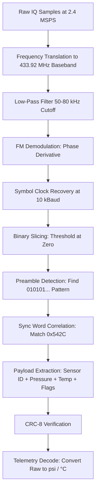

# Signal Specification: TPMS (Tire Pressure Monitoring System)

Tire Pressure Monitoring System (TPMS) sensors are small, battery-powered radio transmitters mounted on each wheel of a vehicle. They periodically broadcast short telemetry packets containing tire pressure, temperature, and sensor status information. TPMS is mandated in the US (since 2007), EU (since 2014), and many other regions.

---

## 1. Physical Layer Parameters

* **Frequency Bands**:
  - **Europe / Asia**: `433.92 MHz` (ISM band)
  - **North America**: `315 MHz`
* **Standard Bandwidths**: `60 kHz to 100 kHz` occupied bandwidth (99% OBW)
* **Modulation**:
  - **Modern sensors**: 2-FSK (Frequency Shift Keying), often with Gaussian pulse shaping (GFSK)
  - **Older sensors**: OOK (On-Off Keying) or ASK (Amplitude Shift Keying)
* **Symbol Rate**: Typically `8 kBaud to 20 kBaud` (10 kBaud is the most common for European sensors)
* **Frequency Deviation ($\Delta f$)**: `20 kHz to 50 kHz` (commonly ~38 kHz for 433 MHz sensors)
* **Modulation Index**: $h = \frac{2 \Delta f}{R_{sym}} \approx 4$ to $10$ (high modulation index — wide separation)
* **Transmit Power**: Very low, typically `−10 dBm to +10 dBm` (~0.1 to 10 mW)

---

## 2. Synchronization & Frame Geometry

### Preamble / Sync Pattern
TPMS sensors use a simple preamble to allow the receiver to lock onto the transmission:
- **Preamble**: Alternating `010101...` bit pattern (creates a square wave at half the symbol rate for clock recovery). Typically `8 to 20 preamble bits`.
- **Sync Word**: A fixed multi-byte synchronization pattern immediately following the preamble. Common sync words include `0x542C`, `0xAAB4`, or manufacturer-specific patterns (12 to 16 bits).

### Frame Format
TPMS packets are short and fixed-length. A typical frame structure:
```
| Preamble (8-20 bits) | Sync Word (12-16 bits) | Sensor ID (24-32 bits) | Pressure (8 bits) | Temperature (8 bits) | Status/Flags (4-8 bits) | CRC-8 (8 bits) |
```

### Field Descriptions
* **Sensor ID**: A unique 24-bit or 32-bit identifier hard-coded into each tire sensor at the factory. This allows the vehicle ECU to distinguish between its own sensors and neighboring vehicles.
* **Pressure**: 8-bit unsigned integer. Typically encoded in units of `0.25 psi` or `1.372 kPa`, offset from 0. Example: A value of `0x8C` (140) = `140 × 0.25 = 35.0 psi`.
* **Temperature**: 8-bit signed or unsigned integer. Commonly offset by `−40°C` (so a raw value of 65 means `65 − 40 = 25°C`).
* **Status/Flags**: Battery low indicator, rapid deflation alert, sensor fault codes.
* **CRC-8**: An 8-bit cyclic redundancy check over the payload fields. Common polynomials: `0x07` (CRC-8), `0x13` (CRC-8/AUTOSAR).

### Burst Characteristics
* **Packet Duration**: Very short — `3 ms to 10 ms` per burst.
* **Duty Cycle**: Extremely low — **< 0.1%**. Sensors transmit one burst every `30 to 60 seconds` while driving, or every `10 to 15 minutes` when stationary.
* **Repetition**: Some sensors repeat the same packet 2-4 times within a short window (~100 ms) for reliability.

---

## 3. Demodulation & Decoding Pipeline



### Step-by-Step

1. **DC Blocking & Frequency Translation**: Center the signal at baseband. If the capture center frequency does not exactly match 433.92 MHz, apply a complex frequency shift: $x_{bb}[n] = x[n] \cdot e^{-j 2\pi f_{offset} n / f_s}$.

2. **Low-Pass Channel Filter**: Apply a low-pass filter with a cutoff of `50 kHz to 80 kHz` to isolate the TPMS signal and reject adjacent-channel interference. A 5th-order Butterworth or a FIR filter with ~50 taps works well.

3. **FM Demodulation**: Compute the instantaneous frequency (phase derivative) of the complex baseband signal:
   $$f_{inst}[n] = \frac{f_s}{2\pi} \cdot \angle\left(x[n] \cdot x^*[n-1]\right)$$

4. **Symbol Clock Recovery**: The demodulated signal is a two-level (binary) waveform at 10 kBaud. Use zero-crossing timing or a Mueller & Müller clock recovery loop to align sample points to symbol centers at intervals of $T_{sym} = 1 / R_{sym} = 100\ \mu\text{s}$.

5. **Binary Slicing**: Threshold the FM-demodulated samples at the midpoint (zero or mean) to recover the raw bitstream.

6. **Preamble & Sync Word Detection**: Correlate the bitstream against the expected preamble pattern and sync word. The sync word marks the start of the payload.

7. **Payload Parsing & CRC Check**: Extract the sensor ID, pressure, temperature, and status fields from their fixed positions in the frame. Verify integrity with the CRC-8 checksum.

---

## 4. Companion Tool: rtl_433

[rtl_433](https://github.com/merbanan/rtl_433) is the standard open-source companion decoder for TPMS and hundreds of other Sub-GHz ISM protocols. It supports dozens of TPMS sensor models out of the box.

### Usage with Raw IQ File
```bash
# Capture raw IQ at 433.92 MHz
rtl_sdr -f 433920000 -s 250000 -g 30 capture.bin

# Decode TPMS packets from raw capture
rtl_433 -r capture.bin -s 250000

# Filter to only TPMS protocols
rtl_433 -r capture.bin -s 250000 -R 60 -R 88 -R 90 -R 91
```

### Expected Output
```
time      : 2025-06-01 14:23:05
model     : Toyota       type: TPMS
id        : 0x1A3F7C02
pressure  : 35.0 psi
temperature: 24 °C
battery_ok: 1
```

---

## 5. Protocol Variants & Regional Notes

| Region | Frequency | Common Manufacturers | Notes |
|---|---|---|---|
| Europe | 433.92 MHz | Continental, Schrader, Huf, Pacific | FSK dominant, 10 kBaud typical |
| North America | 315 MHz | Schrader, Continental, TRW | Mixed FSK/OOK, 8-15 kBaud |
| Asia (Japan/Korea) | 433.92 MHz | Pacific, Sensata | Similar to European spec |
| China | 433.92 MHz | Various | Wide variation in encoding |

### Known Sensor Protocol Families
* **Schrader EZ-Sensor**: 315 MHz, FSK, 10 kBaud, 32-bit ID, sync word `0x5556`
* **Continental/Huf**: 433.92 MHz, FSK, 9.6 kBaud, 28-bit ID, sync word `0x542C`
* **Pacific PMV-C210**: 433.92 MHz, FSK, 19.2 kBaud, 32-bit ID
* **Toyota OEM**: 315 MHz, FSK/Manchester, 32-bit ID
