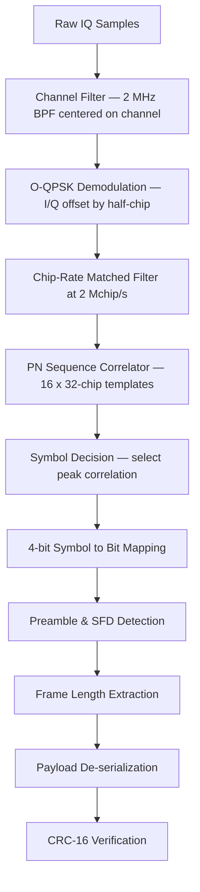
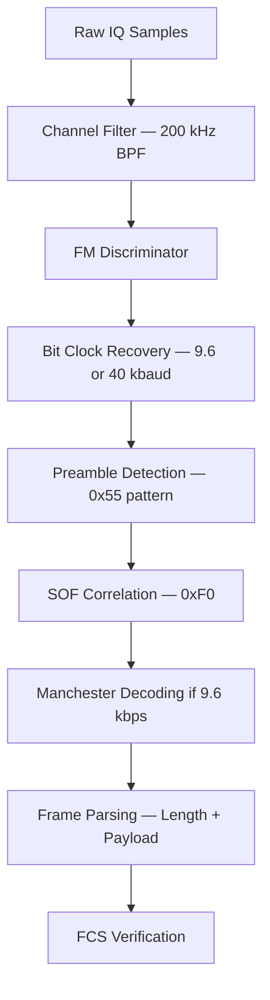

# Signal Specification: Zigbee (IEEE 802.15.4) & Z-Wave

Zigbee is built on the IEEE 802.15.4 physical and MAC layer standard for low-rate wireless personal area networks (LR-WPAN). It is widely used in home automation, industrial sensing, and smart metering. Z-Wave is a proprietary protocol by Silicon Labs (originally Zensys) designed specifically for home automation with a mesh networking topology operating in sub-GHz ISM bands.

---

## 1. Physical Layer Parameters

### Zigbee / IEEE 802.15.4

#### 2.4 GHz Band (Global ISM — Primary)
* **Frequency Range**: 2.405–2.480 GHz
* **Channels**: 16 channels (channels 11–26), 5 MHz spacing
  - Channel center: $f_c = 2405 + 5 \times (k - 11)\\ \text{MHz}$, where $k = 11..26$
* **Modulation**: O-QPSK (Offset Quadrature Phase Shift Keying) with half-sine pulse shaping
* **Spreading**: DSSS (Direct Sequence Spread Spectrum)
  - Each 4-bit symbol is mapped to one of 16 near-orthogonal 32-chip PN sequences
  - Chip rate: **2 Mchip/s**
  - Processing gain: $10 \log_{10}(32/4) = 9.0\\ \text{dB}$
* **Data Rate**: **250 kbps** (symbol rate = 62.5 ksym/s)
* **Occupied Bandwidth**: ~2 MHz (main lobe), ~3.5 MHz (to first nulls)

#### 868 MHz Band (Europe)
* **Frequency**: 868.3 MHz (single channel, channel 0)
* **Modulation**: BPSK with DSSS (15-chip spreading)
* **Chip Rate**: 300 kchip/s
* **Data Rate**: **20 kbps**
* **Occupied Bandwidth**: ~600 kHz

#### 915 MHz Band (Americas)
* **Frequency Range**: 902–928 MHz
* **Channels**: 10 channels (channels 1–10), 2 MHz spacing
  - Channel center: $f_c = 906 + 2 \times (k - 1)\\ \text{MHz}$, where $k = 1..10$
* **Modulation**: BPSK with DSSS (15-chip spreading)
* **Chip Rate**: 600 kchip/s
* **Data Rate**: **40 kbps**
* **Occupied Bandwidth**: ~1.2 MHz

### Z-Wave (ITU-T G.9959)

* **Frequency Bands**:
  - US: **908.42 MHz** (primary), 916.0 MHz (3-channel mode)
  - EU: **868.42 MHz**
  - Australia/NZ: 921.42 MHz
  - Japan: 922.5–926.3 MHz
  - Each region uses a single primary frequency (no frequency hopping)
* **Modulation**:
  - Z-Wave Classic (Gen 1–4): FSK, ±20 kHz deviation
  - Z-Wave Plus (Gen 5, 500 series): FSK, 9.6/40 kbps
  - Z-Wave Long Range (Gen 7, 700/800 series): GFSK, 100 kbps; DSSS-OQPSK optional
* **Data Rates**:
  - 9.6 kbps (legacy, Manchester-encoded FSK)
  - 40 kbps (FSK, NRZ)
  - 100 kbps (Z-Wave Plus v2 / Long Range)
* **Channel Bandwidth**: ~200 kHz (9.6/40 kbps), ~300 kHz (100 kbps)
* **Frame Length**: Max 64 bytes (classic), 170 bytes (Long Range)

---

## 2. Synchronization & Frame Geometry

### IEEE 802.15.4 (Zigbee PHY) Frame Format

```
| Preamble (4 bytes / 32 bits) | SFD (1 byte) | Frame Length (1 byte) | PSDU / MAC Payload (≤127 bytes) | FCS (2 bytes) |
```

#### Preamble
- **4 bytes** of all zeros: `0x00000000`
- After DSSS spreading, this becomes **128 chips** (4 × 32 chips) of the PN sequence for symbol `0000`
- Duration at 2.4 GHz: $128 / 2{,}000{,}000 = 64\\ \mu\text{s}$

#### Start of Frame Delimiter (SFD)
- Fixed byte: `0xA7` (binary `10100111`)
- After spreading: 8 symbols × 32 chips = 256 chips
- Correlation peak against the known SFD sequence marks the exact frame start

#### Frame Length Field
- 7 bits specifying the number of bytes in the PSDU (0–127)
- Bit 7 is reserved

#### Frame Check Sequence (FCS)
- 16-bit ITU-T CRC (polynomial $x^{16} + x^{12} + x^5 + 1$)

### Z-Wave Frame Format

```
| Preamble (10 bytes of 0x55) | SOF (1 byte: 0xF0) | Frame Control | Length | Payload | FCS (1 byte) |
```

#### Z-Wave Preamble
- **10 bytes** of `0x55` (alternating `01010101...`)
- At 9.6 kbps (Manchester): Duration = $10 \times 8 / 9600 = 8.33\\ \text{ms}$
- At 40 kbps: Duration = $10 \times 8 / 40000 = 2.0\\ \text{ms}$

#### Start of Frame (SOF)
- Fixed byte: `0xF0` (`11110000`)

---

## 3. Demodulation & Decoding Pipeline

### Zigbee 2.4 GHz Demodulation



#### O-QPSK with Half-Sine Pulse Shaping
1. **I/Q Separation**: The received signal is split into In-phase (I) and Quadrature (Q) components, where Q is delayed by half a chip period ($T_c/2$).
2. **Chip Recovery**: Each chip is shaped with a half-sine pulse:
   $$p(t) = \sin\left(\frac{\pi t}{T_c}\right), \quad 0 \leq t \leq T_c$$
   This creates MSK-like (Minimum Shift Keying) constant-envelope behavior.
3. **PN Correlator**: Each group of 32 chips is correlated against all 16 possible PN sequences. The sequence with maximum correlation determines the 4-bit symbol.

### Z-Wave Demodulation



---

## 4. Companion Tools

| Tool | Platform | Target Protocol |
|---|---|---|
| **KillerBee** | Linux (Python) | Zigbee — packet capture, replay, fuzzing (requires TI CC2531 or Atmel RZUSBstick) |
| **Wireshark + TI CC2531** | Cross-platform | Zigbee — full protocol dissection |
| **Scapy-radio** | Linux | Zigbee — packet crafting and injection |
| **zigbee2mqtt** | Linux | Zigbee — protocol bridge (useful for protocol understanding) |
| **Z-Wave JS** | Cross-platform | Z-Wave — protocol stack implementation |
| **OpenZWave** | Linux/macOS | Z-Wave — open-source control library |
| **GNU Radio gr-ieee802-15-4** | Linux | IEEE 802.15.4 — full PHY/MAC SDR implementation |
| **HackRF + Universal Radio Hacker** | Cross-platform | Z-Wave — raw signal capture and analysis |
