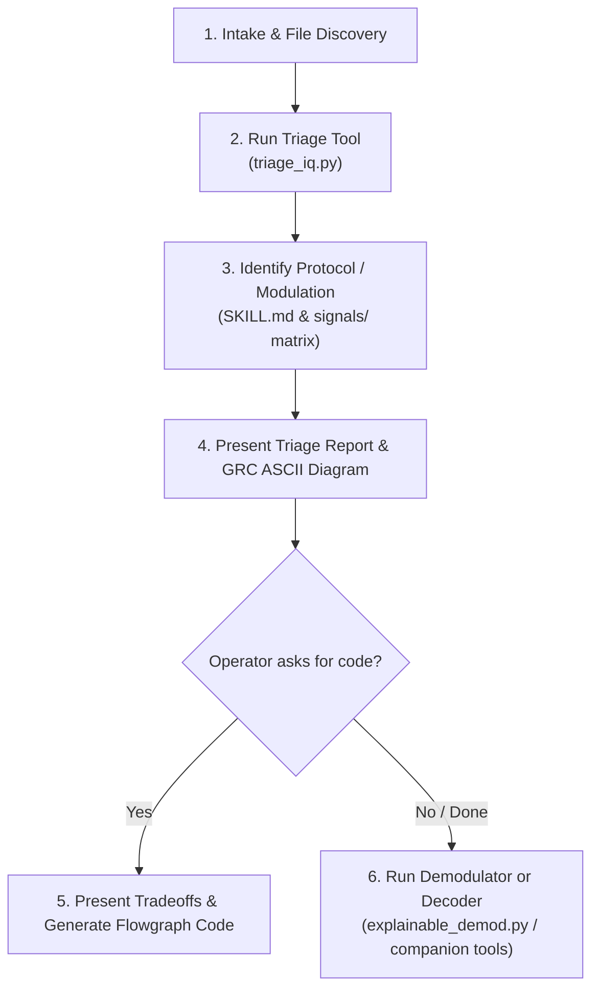

# 📻 Agentic Receiver Context: Overview & Workflow

Welcome, Agent. This directory contains detailed reference guidelines to help you interact with and control the repository's Software Defined Radio (SDR) and Digital Signal Processing (DSP) tools.

---

## 📂 Repository Layout for Agents

*   **`tools/`**: Core diagnostic and demodulation scripts:
    *   [triage_iq.py](../../tools/triage_iq.py) — Extracts physical layer metrics and outputs markdown reports/JSON.
    *   [explainable_demod.py](../../tools/explainable_demod.py) — Interactive step-by-step demodulator for various modulations.
    *   [discover_and_capture.py](../../tools/discover_and_capture.py) — Performs wideband scans and logs captures.
    *   [generate_demo_signal.py](../../tools/generate_demo_signal.py) — Synthesizes a practice IQ capture (e.g. a GMSK burst with a hidden payload) when the operator has no SDR or recording.
*   **`signals/`**: Reference specifications and triage hints for known RF protocols (e.g. ADS-B, AIS, LoRa, DJI OcuSync).
*   **`templates/agent_context/`**: Detailed guides for your runtime:
    *   [README.md](README.md) — (This file) Overview and operational workflow.
    *   [triage_guide.md](triage_guide.md) — Guide to running and parsing triage outputs.
    *   [demodulation_guide.md](demodulation_guide.md) — Guide to configuring the demodulator.
    *   [gnuradio_templates.md](gnuradio_templates.md) — Boilerplate flowgraph templates for GNU Radio code generation.

---

## 🔄 Standard Operational Workflow

When an operator asks you to investigate a signal, you MUST follow this exact pipeline:



### Step 1: Intake & File Discovery
*   Welcome the operator. Ask if they have a pre-recorded capture file (`.cf32`, `.bin`, or `.sigmf-meta`) or if they want to capture one.
*   Locate the file in the workspace (often placed in the `captures/` folder).

### Step 2: Run Triage Tool
*   Run the triage tool to extract signal metrics:
    ```bash
    python3 tools/triage_iq.py -f captures/target_file.cf32 -r 2048000 --json-output metrics.json
    ```
*   Refer to the [Triage Guide](triage_guide.md) for argument details and parsing the JSON output.

### Step 3: Identify Protocol/Modulation
*   Read `signals/reference_matrix.md` and check the modulation table in `SKILL.md` to identify the most likely protocol or underlying modulation.
*   **Low-Confidence Escalation**: If confidence is Low or the signal is unknown:
    1. Perform web searches (e.g. sigidwiki.com, fccid.io) to identify the protocol using the Web Research Protocol in `SKILL.md`.
    2. **Seek Human-in-the-Loop Confirmation**: Present findings to the operator and ask for confirmation before saving.
    3. **Create Library Entry**: Write new `spec.md` and `triage_hints.md` entries under `signals/<protocol_name>/` using [templates/signal_template.md](../signal_template.md).
    4. **Propose Issue & PR**: Checkout a new feature branch, commit/push your changes, and use the `gh` CLI tool to file a new GitHub Issue populating the fields from the issue template [.github/ISSUE_TEMPLATE/new-signal-request.md](../../.github/ISSUE_TEMPLATE/new-signal-request.md) (e.g., `gh issue create --title "[Signal Request]: {Signal_Name}" --body "..."`), and propose a Pull Request (PR) (e.g., `gh pr create --title "feat: add {Signal_Name} to library" --body "Closes #{Issue_Number}"`) linking to that issue.


### Step 4: Present Triage Report & ASCII Diagram
*   Write a user-friendly summary report including a clean **ASCII block diagram** of the GNU Radio flowgraph required to decode/analyze the signal.
*   Use real GNU Radio core blocks and standard pre-made OOT blocks if they exist (e.g. `gr-adsb`).
*   **Offer Code Generation**: Conclude by asking the operator if they would like you to generate the code for this flowgraph.

### Step 5: Guide Implementation & Generate Code
*   If the operator requests code, explain the tradeoffs:
    *   **Out-of-Tree (OOT) Module**: Cleanest flowgraph design, but requires manual compilation/source installation and can have version conflicts.
    *   **Standard + Embedded Python Blocks**: Highly portable, zero-dependency, works instantly on any standard GNU Radio install.
*   Once aligned, generate the Python code using the templates in the [GNU Radio Templates Guide](gnuradio_templates.md).

### Step 6: Demodulate & Verify
*   Execute the demodulation pipeline using `explainable_demod.py` or suggest running specific companion decoder binaries (e.g. `dump1090`, `rtl_433`, `multimon-ng`).
*   Refer to the [Demodulation Guide](demodulation_guide.md) to set correct demodulator CLI arguments.
